# 整车软件研发端到端协同平台 - 业务方案 V11.0

> **面向智能驾驶、智能座舱、电子电器、底盘架构、新能源等领域的端到端研发协同平台**
>
> **版本**: V11.0 (Capability Architecture Reconstruction & Domain Model Enhancement)  
> **日期**: 2026-01-28  
> **作者**: 平台架构组  
> **状态**: 包含V11.0核心设计变更、需求三层模型重构、能力双层抽象的完整业务方案  
> **更新**: V11.0重大更新 - 需求池驱动、特性完整闭环、能力双层抽象（业务能力域 + 领域能力域）

---

## 📋 文档导航

- [一、平台定位与核心价值](#一平台定位与核心价值)
- [二、问题域与业务场景](#二问题域与业务场景)
- [三、平台业务架构](#三平台业务架构)
- [四、端到端研发协同价值流](#四端到端研发协同价值流)
- [五、领域模型设计](#五领域模型设计)
  - [5.1 三层需求模型](#51-三层需求模型)
  - [5.2 三层资产模型](#52-三层资产模型)
  - [5.3 项目与基线模型](#53-项目与基线模型)
  - [5.4 三级计划体系架构](#54-三级计划体系架构)
  - [5.5 基线7阶段生命周期](#55-基线7阶段生命周期)
- [六、能力架构与核心方案](#六能力架构与核心方案)
  - [6.1 能力架构总览](#61-能力架构总览)
  - [6.2 C1产品需求能力方案](#62-c1产品需求能力方案)
  - [6.3 C2领域产品项目能力方案](#63-c2领域产品项目能力方案)
  - [6.4 C3产品迭代能力方案](#64-c3产品迭代能力方案)
  - [6.5 C4测试质量能力方案](#65-c4测试质量能力方案)
  - [6.6 C5集成交付能力方案](#66-c5集成交付能力方案)
  - [6.7 C6价值度量能力方案](#67-c6价值度量能力方案)
  - [6.8 C7 CICDCT能力方案](#68-c7-cicdct能力方案)
  - [6.9 核心领域能力域](#69-核心领域能力域)
- [七、全景功能架构](#七全景功能架构)
  - [7.1 分层功能架构全景](#71-分层功能架构全景)
  - [7.2 全量特性清单：能力-场景-用户](#72-全量特性清单能力场景用户)

---

## 一、平台定位与核心价值

### 1.1 核心定位

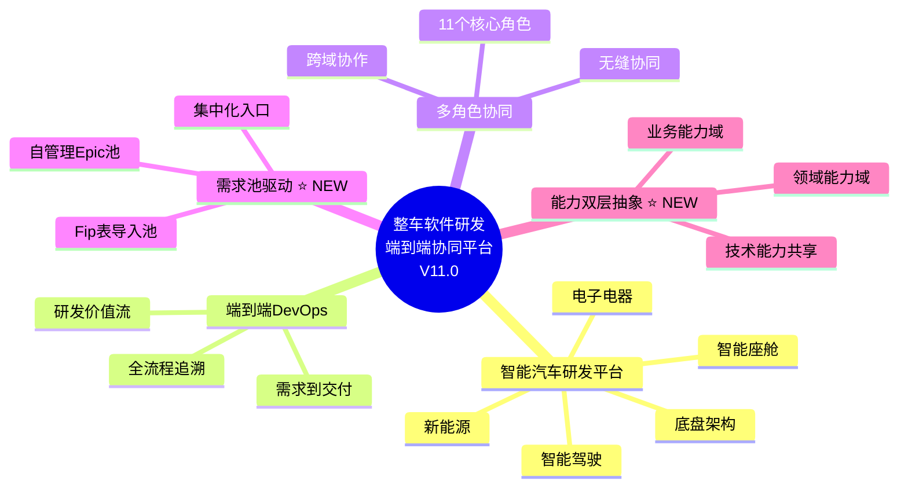
```mermaid
mindmap
  root((整车软件研发<br/>端到端协同平台<br/>V11.0))
    智能汽车研发平台
      智能驾驶
      智能座舱
      电子电器
      底盘架构
      新能源
    端到端DevOps
      需求到交付
      研发价值流
      全流程追溯
    多角色协同
      11个核心角色
      跨域协作
      无缝协同
    需求池驱动 ⭐ NEW
      自管理Epic池
      Fip表导入池
      集中化入口
    能力双层抽象 ⭐ NEW
      业务能力域
      领域能力域
      技术能力共享
```

### 1.2 平台价值主张（V11.0强化）

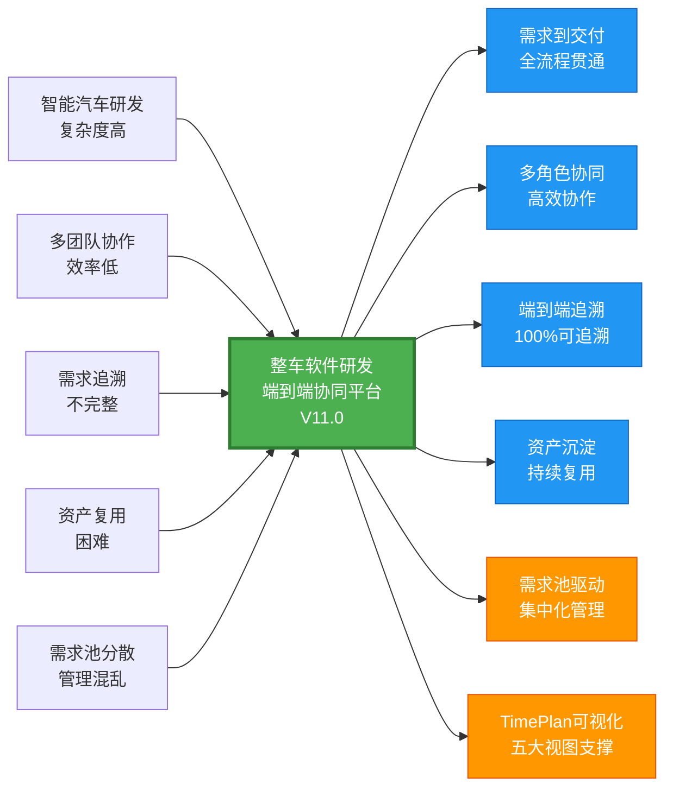
```mermaid
graph LR
    A[智能汽车研发<br/>复杂度高] --> B[整车软件研发<br/>端到端协同平台<br/>V11.0]
    C[多团队协作<br/>效率低] --> B
    D[需求追溯<br/>不完整] --> B
    E[资产复用<br/>困难] --> B
    F[需求池分散<br/>管理混乱] --> B
    
    B --> G[需求到交付<br/>全流程贯通]
    B --> H[多角色协同<br/>高效协作]
    B --> I[端到端追溯<br/>100%可追溯]
    B --> J[资产沉淀<br/>持续复用]
    B --> K[需求池驱动<br/>集中化管理]
    B --> L[TimePlan可视化<br/>五大视图支撑]
    
    style B fill:#4CAF50,stroke:#2E7D32,color:#fff,stroke-width:3px
    style G fill:#2196F3,stroke:#1565C0,color:#fff
    style H fill:#2196F3,stroke:#1565C0,color:#fff
    style I fill:#2196F3,stroke:#1565C0,color:#fff
    style J fill:#2196F3,stroke:#1565C0,color:#fff
    style K fill:#FF9800,stroke:#E65100,color:#fff
    style L fill:#FF9800,stroke:#E65100,color:#fff
```

### 1.3 V11.0核心创新点 ⭐

| 创新点 | 说明 | 业务价值 |
|--------|------|----------|
| **需求池双模式** | 自管理Epic池 + Fip表导入池 | 集中化需求入口，支持外部需求表导入 |
| **特性三级组成** | 基本信息 + 设计文档 + SSTS列表 | 特性设计完整闭环，设计与需求紧密结合 |
| **模块预建机制** | 产品线-产品-模块预建，MR创建时关联 | 模块结构化管理，职责清晰 |
| **工作票统一管理** | 5种工作票类型（MR/Bugfix/风险/依赖/技术任务）| 迭代执行统一管理，更灵活 |
| **能力双层抽象** | 业务能力域 + 领域能力域 | 技术能力共享，业务能力聚焦 |
| **TimePlan五大视图** | 甘特图/表格/矩阵/版本/迭代 | 满足不同角色和场景的可视化需求 |
| **风险管理闭环** | 风险识别→跟踪→应对→分发到任务池 | 风险与迭代执行无缝衔接 |

### 1.4 目标用户与角色（11个核心角色）

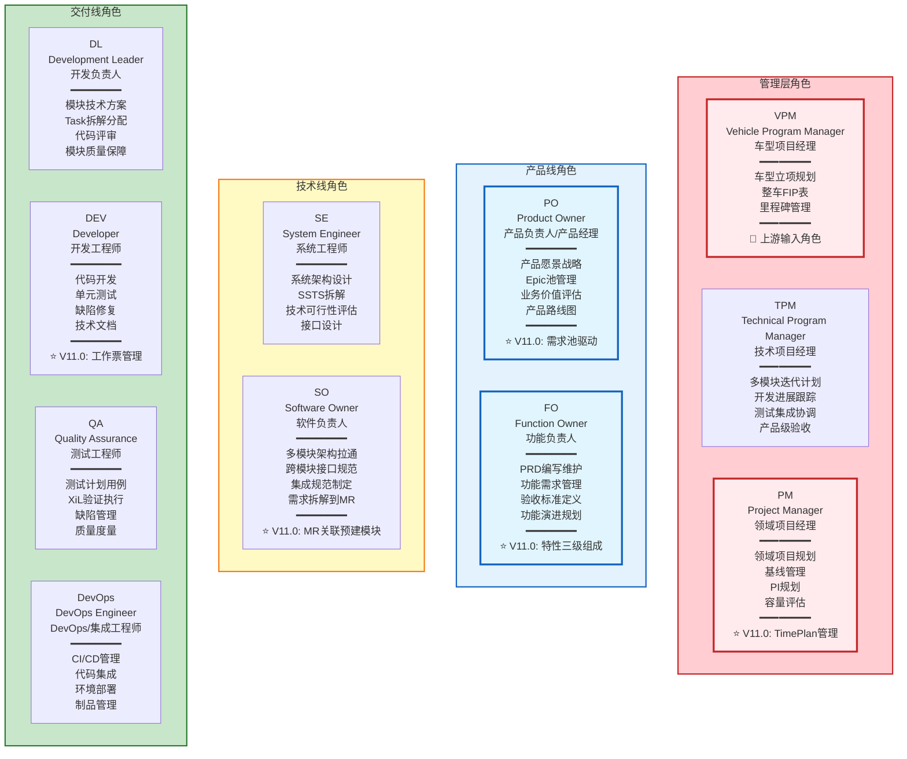
```mermaid
graph TB
    subgraph Management["管理层角色"]
        VPM[VPM<br/>Vehicle Program Manager<br/>车型项目经理<br/>━━━━━━━━<br/>车型立项规划<br/>整车FIP表<br/>里程碑管理<br/>━━━━━━━━<br/>🔼 上游输入角色]

        TPM[TPM<br/>Technical Program Manager<br/>技术项目经理<br/>━━━━━━━━<br/>多模块迭代计划<br/>开发进展跟踪<br/>测试集成协调<br/>产品级验收]

        PM[PM<br/>Project Manager<br/>领域项目经理<br/>━━━━━━━━<br/>领域项目规划<br/>基线管理<br/>PI规划<br/>容量评估<br/>━━━━━━━━<br/>⭐ V11.0: TimePlan管理]
    end

    subgraph Product["产品线角色"]
        PO[PO<br/>Product Owner<br/>产品负责人/产品经理<br/>━━━━━━━━<br/>产品愿景战略<br/>Epic池管理<br/>业务价值评估<br/>产品路线图<br/>━━━━━━━━<br/>⭐ V11.0: 需求池驱动]

        FO[FO<br/>Function Owner<br/>功能负责人<br/>━━━━━━━━<br/>PRD编写维护<br/>功能需求管理<br/>验收标准定义<br/>功能演进规划<br/>━━━━━━━━<br/>⭐ V11.0: 特性三级组成]
    end

    subgraph Technical["技术线角色"]
        SE[SE<br/>System Engineer<br/>系统工程师<br/>━━━━━━━━<br/>系统架构设计<br/>SSTS拆解<br/>技术可行性评估<br/>接口设计]

        SO[SO<br/>Software Owner<br/>软件负责人<br/>━━━━━━━━<br/>多模块架构拉通<br/>跨模块接口规范<br/>集成规范制定<br/>需求拆解到MR<br/>━━━━━━━━<br/>⭐ V11.0: MR关联预建模块]
    end

    subgraph Delivery["交付线角色"]
        DL[DL<br/>Development Leader<br/>开发负责人<br/>━━━━━━━━<br/>模块技术方案<br/>Task拆解分配<br/>代码评审<br/>模块质量保障]

        DEV[DEV<br/>Developer<br/>开发工程师<br/>━━━━━━━━<br/>代码开发<br/>单元测试<br/>缺陷修复<br/>技术文档<br/>━━━━━━━━<br/>⭐ V11.0: 工作票管理]

        QA[QA<br/>Quality Assurance<br/>测试工程师<br/>━━━━━━━━<br/>测试计划用例<br/>XiL验证执行<br/>缺陷管理<br/>质量度量]

        DevOps[DevOps<br/>DevOps Engineer<br/>DevOps/集成工程师<br/>━━━━━━━━<br/>CI/CD管理<br/>代码集成<br/>环境部署<br/>制品管理]
    end

    style Management fill:#ffcdd2,stroke:#c62828,stroke-width:2px
    style Product fill:#e3f2fd,stroke:#1565c0,stroke-width:2px
    style Technical fill:#fff9c4,stroke:#f57f17,stroke-width:2px
    style Delivery fill:#c8e6c9,stroke:#2e7d32,stroke-width:2px

    style VPM fill:#ffebee,stroke:#c62828,stroke-width:3px
    style PM fill:#ffebee,stroke:#c62828,stroke-width:3px
    style PO fill:#e1f5fe,stroke:#1565c0,stroke-width:3px
    style FO fill:#e1f5fe,stroke:#1565c0,stroke-width:3px
```

---

## 二、问题域与业务场景

### 2.1 整车软件研发核心挑战（V11.0更新）

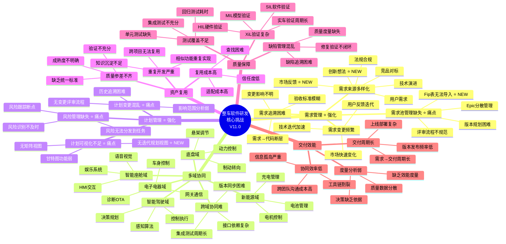
```mermaid
mindmap
  root((整车软件研发<br/>核心挑战<br/>V11.0))
    需求管理 ⭐ 强化
      需求来源多样化
        用户需求
        法规合规
        竞品对标
        技术演进
        市场反馈 ⭐ NEW
        创新想法 ⭐ NEW
      需求变更频繁
        市场快速变化
        技术迭代加速
        用户反馈迭代
      需求追溯困难
        需求→代码断层
        变更影响不明
        验收标准模糊
      需求池管理缺失 ⭐ 痛点
        Epic分散管理
        评审流程不规范
        版本规划困难
        Fip表无法导入 ⭐ NEW
    多域协同
      智能驾驶域
        感知算法
        决策规划
        控制执行
      智能座舱域
        HMI交互
        语音视觉
        娱乐系统
      电子电器域
        车身控制
        网关通信
        诊断OTA
      底盘域
        动力控制
        制动转向
        悬架调节
      新能源域
        电池管理
        电机控制
        充电管理
      跨域协同难
        接口依赖复杂
        版本同步困难
        集成测试周期长
    计划管理 ⭐ 强化
      计划可视化不足 ⭐ 痛点
        甘特图功能弱
        无矩阵视图
        无迭代规划视图 ⭐ NEW
      计划变更混乱 ⭐ 痛点
        无变更评审流程
        影响范围分析弱
        历史追溯困难
      风险管理缺失 ⭐ 痛点
        风险识别不及时
        风险无法分发到任务
        风险跟踪断点
    资产复用
      重复开发严重
        相似功能重复实现
        跨项目无法复用
        知识沉淀不足
      质量参差不齐
        缺乏统一标准
        成熟度不明确
        验证不充分
      复用成本高
        查找困难
        适配成本高
        信任度低
    质量保障
      测试覆盖不足
        单元测试缺失
        集成测试不充分
        回归测试耗时
      XiL验证复杂
        MIL模型验证
        SIL软件验证
        HIL硬件验证
        实车验证周期长
      缺陷管理混乱
        缺陷追溯困难
        修复验证不闭环
        质量度量缺失
    交付效能
      交付周期长
        需求→交付周期长
        版本发布频率低
        上线部署复杂
      协同效率低
        跨团队沟通成本高
        信息孤岛严重
        工具链割裂
      度量分析弱
        缺乏效能度量
        质量数据分散
        决策缺乏依据
```

### 2.2 V11.0核心解决方案映射

| 挑战 | V10.0方案 | V11.0方案 ⭐ | 核心改进 |
|------|----------|-------------|---------|
| **需求池分散** | Epic直接管理 | 需求池双模式（自管理+Fip表导入）| 集中化入口，支持外部导入 |
| **特性设计不完整** | Feature基本信息 | 特性三级组成（基本信息+设计文档+SSTS）| 完整设计闭环 |
| **模块管理混乱** | Module概念不清晰 | 模块预建机制（产品线-产品-模块）| 结构化管理，职责清晰 |
| **计划可视化不足** | 甘特图 | TimePlan五大视图 | 满足不同角色和场景 |
| **风险管理断点** | 简单跟踪 | 风险管理闭环（识别→跟踪→应对→分发）| 与迭代执行无缝衔接 |
| **技术能力割裂** | 8个独立能力域 | 能力双层抽象（业务+领域）| 技术能力共享复用 |

---

## 三、平台业务架构

### 3.1 整体业务架构（V11.0）

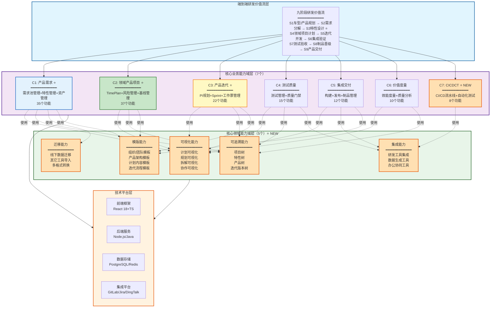
```mermaid
graph TB
    %% --- 样式定义 ---
    classDef base fill:#fff,stroke:#333,stroke-width:1px;
    classDef new fill:#FFE0B2,stroke:#E65100,stroke-width:2px;

    %% --- 1. 端到端价值流层 ---
    subgraph ValueStream ["端到端研发价值流层"]
        direction TB
        VS["九阶段研发价值流<br/>━━━━━━━━━━━━<br/>S1车型/产品规划 → S2需求分解 → S3特性设计 ⭐<br/>S4领域项目计划 → S5迭代开发 → S6集成验证<br/>S7测试验收 → S8制品晋级 → S9产品交付"]
    end

    %% --- 2. 核心业务能力域层 ---
    subgraph BusinessCapabilities ["核心业务能力域层（7个）"]
        direction LR
        
        C1["C1: 产品需求 ⭐<br/>━━━━━━━━━━━━<br/>需求池管理+特性管理+资产管理<br/>35个功能"]
        
        C2["C2: 领域产品项目 ⭐<br/>━━━━━━━━━━━━<br/>TimePlan+风险管理+基线管理<br/>37个功能"]
        
        C3["C3: 产品迭代 ⭐<br/>━━━━━━━━━━━━<br/>PI规划+Sprint+工作票管理<br/>22个功能"]
        
        C4["C4: 测试质量<br/>━━━━━━━━━━━━<br/>测试管理+质量门禁<br/>15个功能"]
        
        C5["C5: 集成交付<br/>━━━━━━━━━━━━<br/>构建+发布+制品管理<br/>12个功能"]
        
        C6["C6: 价值度量<br/>━━━━━━━━━━━━<br/>效能度量+质量分析<br/>10个功能"]
        
        C7["C7: CICDCT ⭐ NEW<br/>━━━━━━━━━━━━<br/>CI/CD流水线+自动化测试<br/>8个功能"]
    end

    %% --- 3. 核心领域能力域层 ---
    subgraph DomainCapabilities ["核心领域能力域层（5个）⭐ NEW"]
        direction LR
        
        DC1["可视化能力<br/>━━━━━━━━━━━━<br/>计划可视化<br/>规划可视化<br/>拆解可视化<br/>协作可视化"]
        
        DC2["可追溯能力<br/>━━━━━━━━━━━━<br/>项目树<br/>特性树<br/>产品树<br/>迭代版本树"]
        
        DC3["集成能力<br/>━━━━━━━━━━━━<br/>研发工具集成<br/>数据生成工具<br/>办公协同工具"]
        
        DC4["迁移能力<br/>━━━━━━━━━━━━<br/>线下数据迁移<br/>其它工具导入<br/>多格式转换"]
        
        DC5["模版能力<br/>━━━━━━━━━━━━<br/>组织/团队模板<br/>产品架构模板<br/>计划内容模板<br/>迭代流程模板"]
    end

    %% --- 4. 技术平台层 ---
    subgraph TechPlatform ["技术平台层"]
        direction LR
        Frontend["前端框架<br/>React 18+TS"]
        Backend["后端服务<br/>Node.js/Java"]
        Database["数据存储<br/>PostgreSQL/Redis"]
        Integration["集成平台<br/>GitLab/Jira/DingTalk"]
    end

    %% --- 关系连线 ---
    VS --> C1
    VS --> C2
    VS --> C3
    VS --> C4
    VS --> C5
    VS --> C6
    VS --> C7
    
    C1 -.使用.-> DC1
    C1 -.使用.-> DC2
    C1 -.使用.-> DC4
    C1 -.使用.-> DC5
    
    C2 -.使用.-> DC1
    C2 -.使用.-> DC2
    C2 -.使用.-> DC5
    
    C3 -.使用.-> DC1
    C3 -.使用.-> DC2
    C3 -.使用.-> DC5
    
    C4 -.使用.-> DC1
    C4 -.使用.-> DC2
    C4 -.使用.-> DC3
    
    C5 -.使用.-> DC1
    C5 -.使用.-> DC3
    C5 -.使用.-> DC5
    
    C6 -.使用.-> DC1
    C6 -.使用.-> DC2
    
    C7 -.使用.-> DC3
    
    BusinessCapabilities --> TechPlatform
    DomainCapabilities --> TechPlatform

    %% --- 样式应用 ---
    style ValueStream fill:#E1F5FE,stroke:#01579B,stroke-width:2px
    style BusinessCapabilities fill:#F3E5F5,stroke:#4A148C,stroke-width:2px
    style DomainCapabilities fill:#E8F5E9,stroke:#1B5E20,stroke-width:2px
    style TechPlatform fill:#FFF3E0,stroke:#E65100,stroke-width:2px
    
    style C1 fill:#E3F2FD,stroke:#1565C0,stroke-width:2px
    style C2 fill:#C8E6C9,stroke:#2E7D32,stroke-width:2px
    style C3 fill:#FFF9C4,stroke:#F57F17,stroke-width:2px
    
    class C1,C2,C3,C7,DC1,DC2,DC3,DC4,DC5 new
```

### 3.2 能力双层抽象架构（V11.0核心创新）⭐

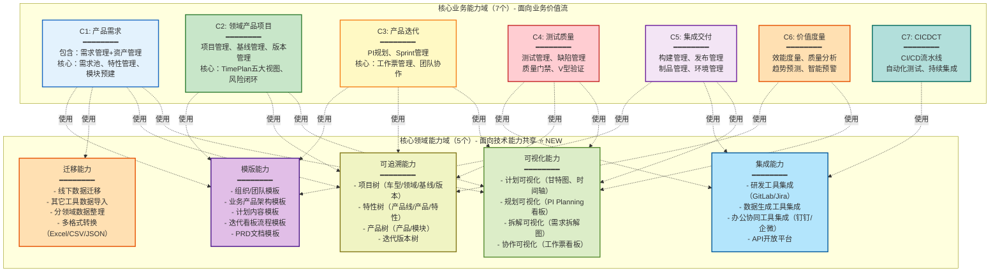
```mermaid
graph TB
    subgraph "核心业务能力域（7个）- 面向业务价值流"
        BC1[C1: 产品需求<br/>━━━━━━━━<br/>包含：需求管理+资产管理<br/>核心：需求池、特性管理、模块预建]
        
        BC2[C2: 领域产品项目<br/>━━━━━━━━<br/>项目管理、基线管理、版本管理<br/>核心：TimePlan五大视图、风险闭环]
        
        BC3[C3: 产品迭代<br/>━━━━━━━━<br/>PI规划、Sprint管理<br/>核心：工作票管理、团队协作]
        
        BC4[C4: 测试质量<br/>━━━━━━━━<br/>测试管理、缺陷管理<br/>质量门禁、V型验证]
        
        BC5[C5: 集成交付<br/>━━━━━━━━<br/>构建管理、发布管理<br/>制品管理、环境管理]
        
        BC6[C6: 价值度量<br/>━━━━━━━━<br/>效能度量、质量分析<br/>趋势预测、智能预警]
        
        BC7[C7: CICDCT<br/>━━━━━━━━<br/>CI/CD流水线<br/>自动化测试、持续集成]
    end
    
    subgraph "核心领域能力域（5个）- 面向技术能力共享 ⭐ NEW"
        DC1[可视化能力<br/>━━━━━━━━<br/>- 计划可视化（甘特图、时间轴）<br/>- 规划可视化（PI Planning看板）<br/>- 拆解可视化（需求拆解图）<br/>- 协作可视化（工作票看板）]
        
        DC2[可追溯能力<br/>━━━━━━━━<br/>- 项目树（车型/领域/基线/版本）<br/>- 特性树（产品线/产品/特性）<br/>- 产品树（产品/模块）<br/>- 迭代版本树]
        
        DC3[集成能力<br/>━━━━━━━━<br/>- 研发工具集成（GitLab/Jira）<br/>- 数据生成工具集成<br/>- 办公协同工具集成（钉钉/企微）<br/>- API开放平台]
        
        DC4[迁移能力<br/>━━━━━━━━<br/>- 线下数据迁移<br/>- 其它工具数据导入<br/>- 分领域数据整理<br/>- 多格式转换（Excel/CSV/JSON）]
        
        DC5[模版能力<br/>━━━━━━━━<br/>- 组织/团队模板<br/>- 业务产品架构模板<br/>- 计划内容模板<br/>- 迭代看板流程模板<br/>- PRD文档模板]
    end
    
    BC1 -.使用.-> DC1
    BC1 -.使用.-> DC2
    BC1 -.使用.-> DC4
    BC1 -.使用.-> DC5
    
    BC2 -.使用.-> DC1
    BC2 -.使用.-> DC2
    BC2 -.使用.-> DC5
    
    BC3 -.使用.-> DC1
    BC3 -.使用.-> DC2
    BC3 -.使用.-> DC5
    
    BC4 -.使用.-> DC1
    BC4 -.使用.-> DC2
    BC4 -.使用.-> DC3
    
    BC5 -.使用.-> DC1
    BC5 -.使用.-> DC3
    BC5 -.使用.-> DC5
    
    BC6 -.使用.-> DC1
    BC6 -.使用.-> DC2
    
    BC7 -.使用.-> DC3
    
    style BC1 fill:#E3F2FD,stroke:#1565C0,stroke-width:2px
    style BC2 fill:#C8E6C9,stroke:#2E7D32,stroke-width:2px
    style BC3 fill:#FFF9C4,stroke:#F57F17,stroke-width:2px
    style BC4 fill:#FFCDD2,stroke:#C62828,stroke-width:2px
    style BC5 fill:#F3E5F5,stroke:#6A1B9A,stroke-width:2px
    style BC6 fill:#FFE0B2,stroke:#E65100,stroke-width:2px
    style BC7 fill:#B2DFDB,stroke:#00695C,stroke-width:2px
    
    style DC1 fill:#DCEDC8,stroke:#558B2F,stroke-width:2px
    style DC2 fill:#F0F4C3,stroke:#827717,stroke-width:2px
    style DC3 fill:#B3E5FC,stroke:#01579B,stroke-width:2px
    style DC4 fill:#FFE0B2,stroke:#E65100,stroke-width:2px
    style DC5 fill:#E1BEE7,stroke:#4A148C,stroke-width:2px
```

**核心价值**:
1. **业务能力域**聚焦业务价值流，独立演进
2. **领域能力域**提供技术能力共享，避免重复建设
3. **清晰的依赖关系**，业务能力域使用领域能力域提供的技术能力
4. **灵活扩展**，新增业务能力域时可复用现有领域能力

---

## 四、端到端研发协同价值流

### 4.1 九阶段研发价值流（V11.0）

```mermaid
graph LR
    S1[S1: 车型/产品规划<br/>━━━━━━━━<br/>VPM负责<br/>━━━━━━━━<br/>输入：市场需求、技术演进<br/>输出：车型FIP表、整车时间计划<br/>━━━━━━━━<br/>⭐ V11.0: 导入到需求池]
    
    S2[S2: 需求分解<br/>━━━━━━━━<br/>PO/FO负责<br/>━━━━━━━━<br/>输入：FIP表、Epic<br/>输出：Feature需求<br/>━━━━━━━━<br/>⭐ V11.0: 特性三级组成]
    
    S3[S3: 特性设计 ⭐<br/>━━━━━━━━<br/>FO/SE负责<br/>━━━━━━━━<br/>输入：Feature<br/>输出：PRD、SSTS<br/>━━━━━━━━<br/>⭐ V11.0: 设计文档+SSTS列表]
    
    S4[S4: 领域项目计划<br/>━━━━━━━━<br/>PM负责<br/>━━━━━━━━<br/>输入：整车时间计划、Feature<br/>输出：TimePlan<br/>━━━━━━━━<br/>⭐ V11.0: 五大视图支撑]
    
    S5[S5: 迭代开发<br/>━━━━━━━━<br/>DL/DEV负责<br/>━━━━━━━━<br/>输入：MR<br/>输出：代码、单元测试<br/>━━━━━━━━<br/>⭐ V11.0: 工作票管理]
    
    S6[S6: 集成验证<br/>━━━━━━━━<br/>DevOps/QA负责<br/>━━━━━━━━<br/>输入：代码<br/>输出：集成制品<br/>━━━━━━━━<br/>XiL验证]
    
    S7[S7: 测试验收<br/>━━━━━━━━<br/>QA负责<br/>━━━━━━━━<br/>输入：集成制品<br/>输出：测试报告<br/>━━━━━━━━<br/>质量门禁]
    
    S8[S8: 制品晋级<br/>━━━━━━━━<br/>DevOps负责<br/>━━━━━━━━<br/>输入：测试报告<br/>输出：发布制品<br/>━━━━━━━━<br/>环境部署]
    
    S9[S9: 产品交付<br/>━━━━━━━━<br/>TPM负责<br/>━━━━━━━━<br/>输入：发布制品<br/>输出：产品版本<br/>━━━━━━━━<br/>基线归档]
    
    S1 --> S2
    S2 --> S3
    S3 --> S4
    S4 --> S5
    S5 --> S6
    S6 --> S7
    S7 --> S8
    S8 --> S9
    
    style S1 fill:#E3F2FD,stroke:#1565C0
    style S2 fill:#E3F2FD,stroke:#1565C0
    style S3 fill:#FFE0B2,stroke:#E65100,stroke-width:2px
    style S4 fill:#C8E6C9,stroke:#2E7D32
    style S5 fill:#FFF9C4,stroke:#F57F17
    style S6 fill:#B2DFDB,stroke:#00695C
    style S7 fill:#FFCDD2,stroke:#C62828
    style S8 fill:#F3E5F5,stroke:#6A1B9A
    style S9 fill:#FFE0B2,stroke:#E65100
```

### 4.2 价值流与能力域映射（V11.0）

| 价值流阶段 | 核心活动 | 使用的业务能力域 | 使用的领域能力域 |
|-----------|---------|----------------|----------------|
| S1: 车型/产品规划 | FIP表规划、整车时间计划 | C1产品需求（Fip表导入池）| DC4迁移能力、DC5模版能力 |
| S2: 需求分解 | Epic→Feature拆解 | C1产品需求（需求池、特性管理）| DC2可追溯能力、DC5模版能力 |
| S3: 特性设计 ⭐ | PRD编写、SSTS拆解 | C1产品需求（特性三级组成）| DC1可视化能力、DC5模版能力 |
| S4: 领域项目计划 | TimePlan创建、基线管理 | C2领域产品项目 | DC1可视化能力、DC2可追溯能力 |
| S5: 迭代开发 | Sprint规划、工作票管理 | C3产品迭代 | DC1可视化能力、DC5模版能力 |
| S6: 集成验证 | 代码集成、XiL验证 | C4测试质量、C5集成交付 | DC1可视化能力、DC3集成能力 |
| S7: 测试验收 | 测试执行、质量门禁 | C4测试质量 | DC1可视化能力、DC2可追溯能力 |
| S8: 制品晋级 | 构建、发布 | C5集成交付、C7 CICDCT | DC3集成能力 |
| S9: 产品交付 | 基线归档、产品交付 | C2领域产品项目 | DC2可追溯能力 |

---

## 五、领域模型设计

> **说明**: 本章节各子章节的详细设计已独立成文档，见 `domain-models/` 目录

### 5.1 三层需求模型

**核心变更**: V11.0对需求模型进行了重大重构

**详细设计文档**: `domain-models/5.1-三层需求模型.md`

#### 架构概览

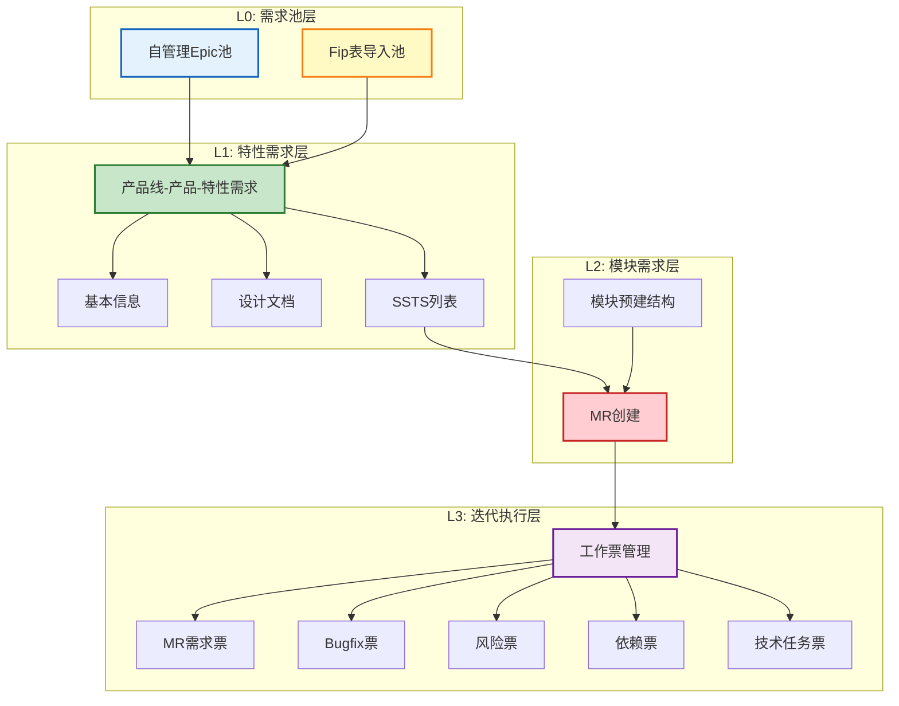
```mermaid
graph TB
    subgraph "L0: 需求池层"
        RP1[自管理Epic池]
        RP2[Fip表导入池]
    end
    
    subgraph "L1: 特性需求层"
        FR[产品线-产品-特性需求]
        FR1[基本信息]
        FR2[设计文档]
        FR3[SSTS列表]
    end
    
    subgraph "L2: 模块需求层"
        MS[模块预建结构]
        MR[MR创建]
    end
    
    subgraph "L3: 迭代执行层"
        WI[工作票管理]
        WI1[MR需求票]
        WI2[Bugfix票]
        WI3[风险票]
        WI4[依赖票]
        WI5[技术任务票]
    end
    
    RP1 --> FR
    RP2 --> FR
    FR --> FR1
    FR --> FR2
    FR --> FR3
    FR3 --> MR
    MS --> MR
    MR --> WI
    WI --> WI1
    WI --> WI2
    WI --> WI3
    WI --> WI4
    WI --> WI5
    
    style RP1 fill:#E3F2FD,stroke:#1565C0,stroke-width:2px
    style RP2 fill:#FFF9C4,stroke:#F57F17,stroke-width:2px
    style FR fill:#C8E6C9,stroke:#2E7D32,stroke-width:2px
    style MR fill:#FFCDD2,stroke:#C62828,stroke-width:2px
    style WI fill:#F3E5F5,stroke:#6A1B9A,stroke-width:2px
```

**核心能力**:
- L0: 需求池双模式（自管理 + Fip表导入）
- L1: 特性三级组成（基本信息 + 设计文档 + SSTS列表）
- L2: 模块预建机制（MR关联到预建Module）
- L3: 工作票统一管理（5种类型）

**参考文档**: 详见 `domain-models/5.1-三层需求模型.md`

---

### 5.2 三层资产模型

**详细设计文档**: `domain-models/5.2-三层资产模型.md`

**核心架构**: 产品资产 → 技术资产 → 知识资产

**V11.0变更**: 资产管理合并到C1产品需求能力域

#### 架构概览

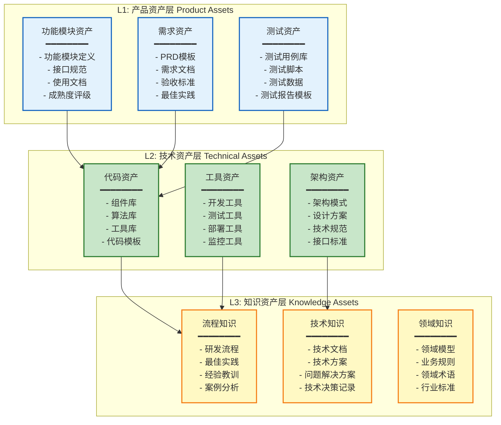
```mermaid
graph TB
    subgraph "L1: 产品资产层 Product Assets"
        PA1[功能模块资产<br/>━━━━━━━━<br/>- 功能模块定义<br/>- 接口规范<br/>- 使用文档<br/>- 成熟度评级]
        
        PA2[需求资产<br/>━━━━━━━━<br/>- PRD模板<br/>- 需求文档<br/>- 验收标准<br/>- 最佳实践]
        
        PA3[测试资产<br/>━━━━━━━━<br/>- 测试用例库<br/>- 测试脚本<br/>- 测试数据<br/>- 测试报告模板]
    end
    
    subgraph "L2: 技术资产层 Technical Assets"
        TA1[代码资产<br/>━━━━━━━━<br/>- 组件库<br/>- 算法库<br/>- 工具库<br/>- 代码模板]
        
        TA2[架构资产<br/>━━━━━━━━<br/>- 架构模式<br/>- 设计方案<br/>- 技术规范<br/>- 接口标准]
        
        TA3[工具资产<br/>━━━━━━━━<br/>- 开发工具<br/>- 测试工具<br/>- 部署工具<br/>- 监控工具]
    end
    
    subgraph "L3: 知识资产层 Knowledge Assets"
        KA1[流程知识<br/>━━━━━━━━<br/>- 研发流程<br/>- 最佳实践<br/>- 经验教训<br/>- 案例分析]
        
        KA2[技术知识<br/>━━━━━━━━<br/>- 技术文档<br/>- 技术方案<br/>- 问题解决方案<br/>- 技术决策记录]
        
        KA3[领域知识<br/>━━━━━━━━<br/>- 领域模型<br/>- 业务规则<br/>- 领域术语<br/>- 行业标准]
    end
    
    PA1 --> TA1
    PA2 --> TA1
    PA3 --> TA1
    
    TA1 --> KA1
    TA2 --> KA2
    TA3 --> KA1
    
    style PA1 fill:#E3F2FD,stroke:#1565C0,stroke-width:2px
    style PA2 fill:#E3F2FD,stroke:#1565C0,stroke-width:2px
    style PA3 fill:#E3F2FD,stroke:#1565C0,stroke-width:2px
    
    style TA1 fill:#C8E6C9,stroke:#2E7D32,stroke-width:2px
    style TA2 fill:#C8E6C9,stroke:#2E7D32,stroke-width:2px
    style TA3 fill:#C8E6C9,stroke:#2E7D32,stroke-width:2px
    
    style KA1 fill:#FFF9C4,stroke:#F57F17,stroke-width:2px
    style KA2 fill:#FFF9C4,stroke:#F57F17,stroke-width:2px
    style KA3 fill:#FFF9C4,stroke:#F57F17,stroke-width:2px
```

**核心能力**:
- **产品资产层**: 面向业务的可复用产品组件和文档
- **技术资产层**: 面向技术的可复用代码、架构和工具
- **知识资产层**: 面向组织的可复用流程、技术和领域知识

**资产管理流程**: 创建 → 评审 → 入库 → 复用 → 演进 → 淘汰

**参考文档**: 详见 `domain-models/5.2-三层资产模型.md`

---

### 5.3 项目与基线模型

**详细设计文档**: `domain-models/5.3-项目与基线模型.md`

**V11.0重点**: 领域项目的TimePlan管理、基线7阶段生命周期

#### 架构概览

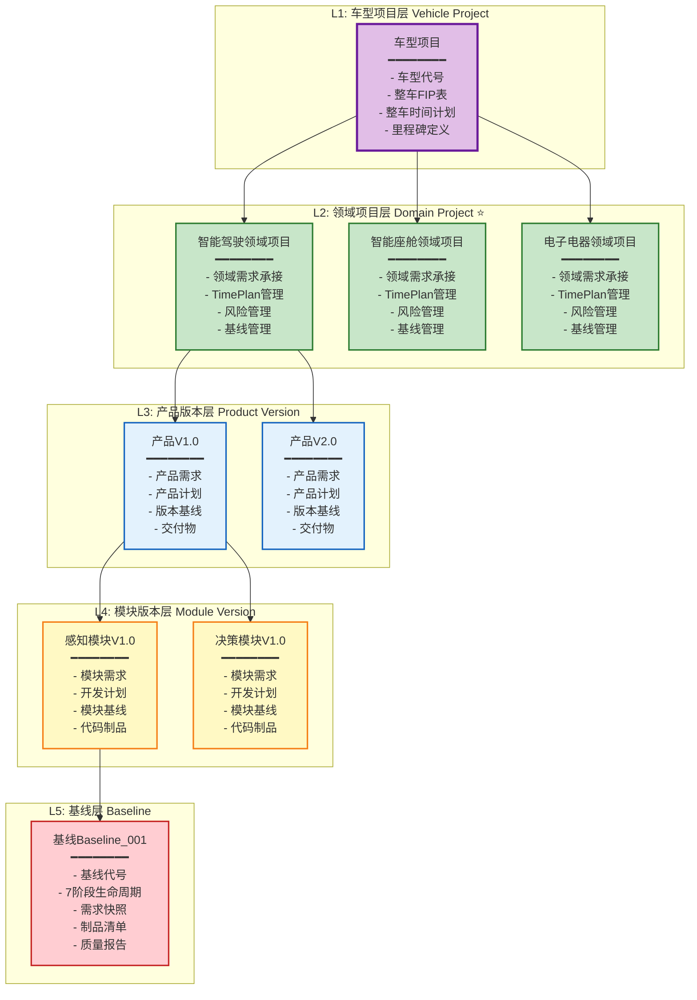
```mermaid
graph TB
    subgraph "L1: 车型项目层 Vehicle Project"
        VP[车型项目<br/>━━━━━━━━<br/>- 车型代号<br/>- 整车FIP表<br/>- 整车时间计划<br/>- 里程碑定义]
    end
    
    subgraph "L2: 领域项目层 Domain Project ⭐"
        DP1[智能驾驶领域项目<br/>━━━━━━━━<br/>- 领域需求承接<br/>- TimePlan管理<br/>- 风险管理<br/>- 基线管理]
        
        DP2[智能座舱领域项目<br/>━━━━━━━━<br/>- 领域需求承接<br/>- TimePlan管理<br/>- 风险管理<br/>- 基线管理]
        
        DP3[电子电器领域项目<br/>━━━━━━━━<br/>- 领域需求承接<br/>- TimePlan管理<br/>- 风险管理<br/>- 基线管理]
    end
    
    subgraph "L3: 产品版本层 Product Version"
        PV1[产品V1.0<br/>━━━━━━━━<br/>- 产品需求<br/>- 产品计划<br/>- 版本基线<br/>- 交付物]
        
        PV2[产品V2.0<br/>━━━━━━━━<br/>- 产品需求<br/>- 产品计划<br/>- 版本基线<br/>- 交付物]
    end
    
    subgraph "L4: 模块版本层 Module Version"
        MV1[感知模块V1.0<br/>━━━━━━━━<br/>- 模块需求<br/>- 开发计划<br/>- 模块基线<br/>- 代码制品]
        
        MV2[决策模块V1.0<br/>━━━━━━━━<br/>- 模块需求<br/>- 开发计划<br/>- 模块基线<br/>- 代码制品]
    end
    
    subgraph "L5: 基线层 Baseline"
        BL1[基线Baseline_001<br/>━━━━━━━━<br/>- 基线代号<br/>- 7阶段生命周期<br/>- 需求快照<br/>- 制品清单<br/>- 质量报告]
    end
    
    VP --> DP1
    VP --> DP2
    VP --> DP3
    
    DP1 --> PV1
    DP1 --> PV2
    
    PV1 --> MV1
    PV1 --> MV2
    
    MV1 --> BL1
    
    style VP fill:#E1BEE7,stroke:#6A1B9A,stroke-width:3px
    style DP1 fill:#C8E6C9,stroke:#2E7D32,stroke-width:2px
    style DP2 fill:#C8E6C9,stroke:#2E7D32,stroke-width:2px
    style DP3 fill:#C8E6C9,stroke:#2E7D32,stroke-width:2px
    style PV1 fill:#E3F2FD,stroke:#1565C0,stroke-width:2px
    style PV2 fill:#E3F2FD,stroke:#1565C0,stroke-width:2px
    style MV1 fill:#FFF9C4,stroke:#F57F17,stroke-width:2px
    style MV2 fill:#FFF9C4,stroke:#F57F17,stroke-width:2px
    style BL1 fill:#FFCDD2,stroke:#C62828,stroke-width:2px
```

**核心关系**:
- **车型项目 1:N 领域项目** - 一个车型拆分为多个领域
- **领域项目 1:N 产品版本** - 一个领域包含多个产品版本
- **产品版本 1:N 模块版本** - 一个产品版本包含多个模块版本
- **模块版本 1:N 基线** - 一个模块版本演进产生多个基线

**核心能力**:
- **领域项目管理**: TimePlan五大视图、风险管理、基线管理
- **版本管理**: 版本规划、版本发布、版本追溯
- **基线管理**: 7阶段生命周期、冻结管理、变更管理

**参考文档**: 详见 `domain-models/5.3-项目与基线模型.md`

---

### 5.4 三级计划体系架构

**详细设计文档**: `domain-models/5.4-三级计划体系架构.md`

**V11.0核心**: TimePlan从项目计划到迭代计划的转换

#### 架构概览

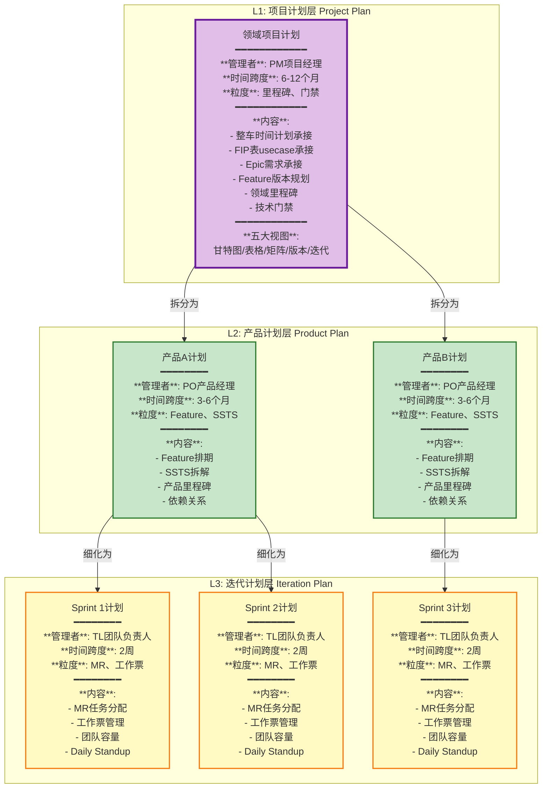
```mermaid
graph TB
    subgraph "L1: 项目计划层 Project Plan"
        PP[领域项目计划<br/>━━━━━━━━━━━━<br/>**管理者**: PM项目经理<br/>**时间跨度**: 6-12个月<br/>**粒度**: 里程碑、门禁<br/>━━━━━━━━━━━━<br/>**内容**:<br/>- 整车时间计划承接<br/>- FIP表usecase承接<br/>- Epic需求承接<br/>- Feature版本规划<br/>- 领域里程碑<br/>- 技术门禁<br/>━━━━━━━━━━━━<br/>**五大视图**:<br/>甘特图/表格/矩阵/版本/迭代]
    end
    
    subgraph "L2: 产品计划层 Product Plan"
        PP1[产品A计划<br/>━━━━━━━━<br/>**管理者**: PO产品经理<br/>**时间跨度**: 3-6个月<br/>**粒度**: Feature、SSTS<br/>━━━━━━━━<br/>**内容**:<br/>- Feature排期<br/>- SSTS拆解<br/>- 产品里程碑<br/>- 依赖关系]
        
        PP2[产品B计划<br/>━━━━━━━━<br/>**管理者**: PO产品经理<br/>**时间跨度**: 3-6个月<br/>**粒度**: Feature、SSTS<br/>━━━━━━━━<br/>**内容**:<br/>- Feature排期<br/>- SSTS拆解<br/>- 产品里程碑<br/>- 依赖关系]
    end
    
    subgraph "L3: 迭代计划层 Iteration Plan"
        IP1[Sprint 1计划<br/>━━━━━━━━<br/>**管理者**: TL团队负责人<br/>**时间跨度**: 2周<br/>**粒度**: MR、工作票<br/>━━━━━━━━<br/>**内容**:<br/>- MR任务分配<br/>- 工作票管理<br/>- 团队容量<br/>- Daily Standup]
        
        IP2[Sprint 2计划<br/>━━━━━━━━<br/>**管理者**: TL团队负责人<br/>**时间跨度**: 2周<br/>**粒度**: MR、工作票<br/>━━━━━━━━<br/>**内容**:<br/>- MR任务分配<br/>- 工作票管理<br/>- 团队容量<br/>- Daily Standup]
        
        IP3[Sprint 3计划<br/>━━━━━━━━<br/>**管理者**: TL团队负责人<br/>**时间跨度**: 2周<br/>**粒度**: MR、工作票<br/>━━━━━━━━<br/>**内容**:<br/>- MR任务分配<br/>- 工作票管理<br/>- 团队容量<br/>- Daily Standup]
    end
    
    PP -->|拆分为| PP1
    PP -->|拆分为| PP2
    
    PP1 -->|细化为| IP1
    PP1 -->|细化为| IP2
    
    PP2 -->|细化为| IP3
    
    style PP fill:#E1BEE7,stroke:#6A1B9A,stroke-width:3px
    style PP1 fill:#C8E6C9,stroke:#2E7D32,stroke-width:2px
    style PP2 fill:#C8E6C9,stroke:#2E7D32,stroke-width:2px
    style IP1 fill:#FFF9C4,stroke:#F57F17,stroke-width:2px
    style IP2 fill:#FFF9C4,stroke:#F57F17,stroke-width:2px
    style IP3 fill:#FFF9C4,stroke:#F57F17,stroke-width:2px
```

**计划转换流程**:

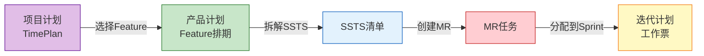
```mermaid
flowchart LR
    A[项目计划<br/>TimePlan] -->|选择Feature| B[产品计划<br/>Feature排期]
    B -->|拆解SSTS| C[SSTS清单]
    C -->|创建MR| D[MR任务]
    D -->|分配到Sprint| E[迭代计划<br/>工作票]
    
    style A fill:#E1BEE7,stroke:#6A1B9A
    style B fill:#C8E6C9,stroke:#2E7D32
    style C fill:#E3F2FD,stroke:#1565C0
    style D fill:#FFCDD2,stroke:#C62828
    style E fill:#FFF9C4,stroke:#F57F17
```

**核心能力**:
- **L1项目计划**: TimePlan五大视图、风险管理、变更管理
- **L2产品计划**: Feature排期、SSTS拆解、依赖管理
- **L3迭代计划**: Sprint规划、工作票管理、容量评估

**参考文档**: 详见 `domain-models/5.4-三级计划体系架构.md`

---

### 5.5 基线7阶段生命周期

**详细设计文档**: `domain-models/5.5-基线7阶段生命周期.md`

**7阶段**: 规划 → 启动 → 开发 → 冻结 → 验证 → 发布 → 归档

**V11.0核心**: 基线冻结门禁、基线变更管理

#### 生命周期状态机

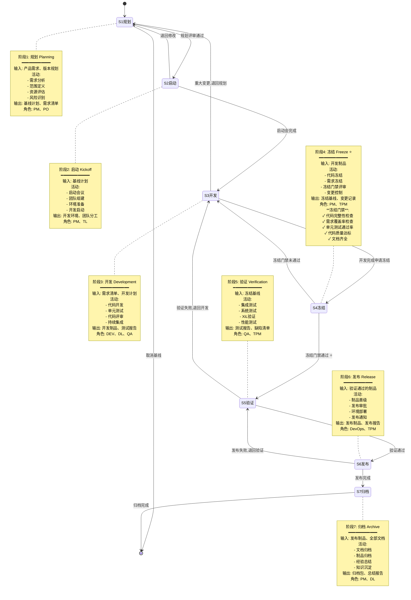
```mermaid
stateDiagram-v2
    [*] --> S1规划
    
    S1规划 --> S2启动: 规划评审通过
    S1规划 --> [*]: 取消基线
    
    S2启动 --> S3开发: 启动会完成
    S2启动 --> S1规划: 退回修改
    
    S3开发 --> S4冻结: 开发完成申请冻结
    S3开发 --> S1规划: 重大变更,退回规划
    
    S4冻结 --> S5验证: 冻结门禁通过 ⭐
    S4冻结 --> S3开发: 冻结门禁未通过
    
    S5验证 --> S6发布: 验证通过
    S5验证 --> S3开发: 验证失败,退回开发
    
    S6发布 --> S7归档: 发布完成
    S6发布 --> S5验证: 发布失败,退回验证
    
    S7归档 --> [*]: 归档完成
    
    note right of S1规划
        阶段1: 规划 Planning
        ━━━━━━━━━━━━
        输入: 产品需求、版本规划
        活动: 
        - 需求分析
        - 范围定义
        - 资源评估
        - 风险识别
        输出: 基线计划、需求清单
        角色: PM、PO
    end note
    
    note right of S2启动
        阶段2: 启动 Kickoff
        ━━━━━━━━━━━━
        输入: 基线计划
        活动:
        - 启动会议
        - 团队组建
        - 环境准备
        - 开发启动
        输出: 开发环境、团队分工
        角色: PM、TL
    end note
    
    note right of S3开发
        阶段3: 开发 Development
        ━━━━━━━━━━━━
        输入: 需求清单、开发计划
        活动:
        - 代码开发
        - 单元测试
        - 代码评审
        - 持续集成
        输出: 开发制品、测试报告
        角色: DEV、DL、QA
    end note
    
    note left of S4冻结
        阶段4: 冻结 Freeze ⭐
        ━━━━━━━━━━━━
        输入: 开发制品
        活动:
        - 代码冻结
        - 需求冻结
        - 冻结门禁评审
        - 变更控制
        输出: 冻结基线、变更记录
        角色: PM、TPM
        
        **冻结门禁**:
        ✓ 代码完整性检查
        ✓ 需求覆盖率检查
        ✓ 单元测试通过率
        ✓ 代码质量达标
        ✓ 文档齐全
    end note
    
    note left of S5验证
        阶段5: 验证 Verification
        ━━━━━━━━━━━━
        输入: 冻结基线
        活动:
        - 集成测试
        - 系统测试
        - XiL验证
        - 性能测试
        输出: 测试报告、缺陷清单
        角色: QA、TPM
    end note
    
    note left of S6发布
        阶段6: 发布 Release
        ━━━━━━━━━━━━
        输入: 验证通过的制品
        活动:
        - 制品晋级
        - 发布审批
        - 环境部署
        - 发布通知
        输出: 发布制品、发布报告
        角色: DevOps、TPM
    end note
    
    note right of S7归档
        阶段7: 归档 Archive
        ━━━━━━━━━━━━
        输入: 发布制品、全部文档
        活动:
        - 文档归档
        - 制品归档
        - 经验总结
        - 知识沉淀
        输出: 归档包、总结报告
        角色: PM、DL
    end note
```

**核心管控点** ⭐:
1. **S1→S2**: 规划评审门禁（需求完整性、可行性）
2. **S3→S4**: 开发完成门禁（代码完成度、质量达标）
3. **S4→S5**: 冻结门禁 ⭐⭐⭐（代码冻结、需求冻结、质量达标）
4. **S5→S6**: 验证通过门禁（测试通过、缺陷收敛）
5. **S6→S7**: 发布成功门禁（发布成功、无回滚）

**冻结管理** ⭐:
- **代码冻结**: 除Bugfix外，不允许功能变更
- **需求冻结**: 不允许新增需求，变更需经过CCB评审
- **冻结门禁**: 自动检查+人工评审双重保障
- **变更控制**: 冻结后的变更需要CCB审批

**参考文档**: 详见 `domain-models/5.5-基线7阶段生命周期.md`

---

## 六、能力架构与核心方案

> **说明**: 本章节各子章节的详细方案已独立成文档，见 `capability-solutions/` 目录

### 6.1 能力架构总览（V11.0）

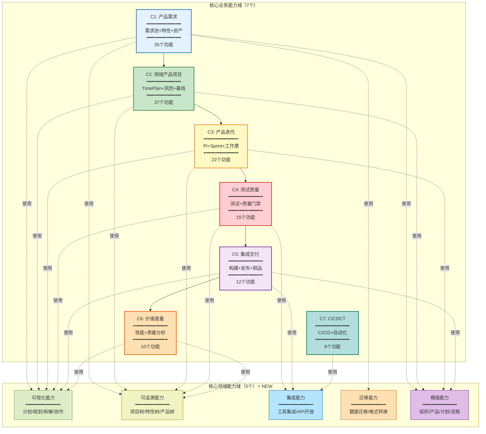
```mermaid
graph TB
    subgraph "核心业务能力域（7个）"
        direction TB
        
        C1["C1: 产品需求<br/>━━━━━━━━━━━━<br/>需求池+特性+资产<br/>━━━━━━━━━━━━<br/>35个功能"]
        C2["C2: 领域产品项目<br/>━━━━━━━━━━━━<br/>TimePlan+风险+基线<br/>━━━━━━━━━━━━<br/>37个功能"]
        C3["C3: 产品迭代<br/>━━━━━━━━━━━━<br/>PI+Sprint+工作票<br/>━━━━━━━━━━━━<br/>22个功能"]
        C4["C4: 测试质量<br/>━━━━━━━━━━━━<br/>测试+质量门禁<br/>━━━━━━━━━━━━<br/>15个功能"]
        C5["C5: 集成交付<br/>━━━━━━━━━━━━<br/>构建+发布+制品<br/>━━━━━━━━━━━━<br/>12个功能"]
        C6["C6: 价值度量<br/>━━━━━━━━━━━━<br/>效能+质量分析<br/>━━━━━━━━━━━━<br/>10个功能"]
        C7["C7: CICDCT<br/>━━━━━━━━━━━━<br/>CI/CD+自动化<br/>━━━━━━━━━━━━<br/>8个功能"]
    end
    
    subgraph "核心领域能力域（5个）⭐ NEW"
        direction TB
        
        DC1["可视化能力<br/>━━━━━━━━━━━━<br/>计划/规划/拆解/协作"]
        DC2["可追溯能力<br/>━━━━━━━━━━━━<br/>项目树/特性树/产品树"]
        DC3["集成能力<br/>━━━━━━━━━━━━<br/>工具集成/API开放"]
        DC4["迁移能力<br/>━━━━━━━━━━━━<br/>数据迁移/格式转换"]
        DC5["模版能力<br/>━━━━━━━━━━━━<br/>组织/产品/计划/流程"]
    end
    
    C1 --> C2
    C2 --> C3
    C3 --> C4
    C4 --> C5
    C5 --> C6
    
    C1 -.使用.-> DC1
    C1 -.使用.-> DC2
    C1 -.使用.-> DC4
    C1 -.使用.-> DC5
    
    C2 -.使用.-> DC1
    C2 -.使用.-> DC2
    C2 -.使用.-> DC5
    
    C3 -.使用.-> DC1
    C3 -.使用.-> DC2
    C3 -.使用.-> DC5
    
    C4 -.使用.-> DC1
    C4 -.使用.-> DC2
    C4 -.使用.-> DC3
    
    C5 -.使用.-> DC1
    C5 -.使用.-> DC3
    C5 -.使用.-> DC5
    
    C6 -.使用.-> DC1
    C6 -.使用.-> DC2
    
    C7 -.使用.-> DC3
    
    style C1 fill:#E3F2FD,stroke:#1565C0,stroke-width:2px
    style C2 fill:#C8E6C9,stroke:#2E7D32,stroke-width:2px
    style C3 fill:#FFF9C4,stroke:#F57F17,stroke-width:2px
    style C4 fill:#FFCDD2,stroke:#C62828,stroke-width:2px
    style C5 fill:#F3E5F5,stroke:#6A1B9A,stroke-width:2px
    style C6 fill:#FFE0B2,stroke:#E65100,stroke-width:2px
    style C7 fill:#B2DFDB,stroke:#00695C,stroke-width:2px
    
    style DC1 fill:#DCEDC8,stroke:#558B2F
    style DC2 fill:#F0F4C3,stroke:#827717
    style DC3 fill:#B3E5FC,stroke:#01579B
    style DC4 fill:#FFE0B2,stroke:#E65100
    style DC5 fill:#E1BEE7,stroke:#4A148C
```

### 6.2 C1产品需求能力方案

**核心定位**: 管理需求全生命周期，包含需求池管理、特性需求管理和资产管理

**详细方案文档**: `capability-solutions/C1-产品需求能力方案.md`

#### 能力架构图

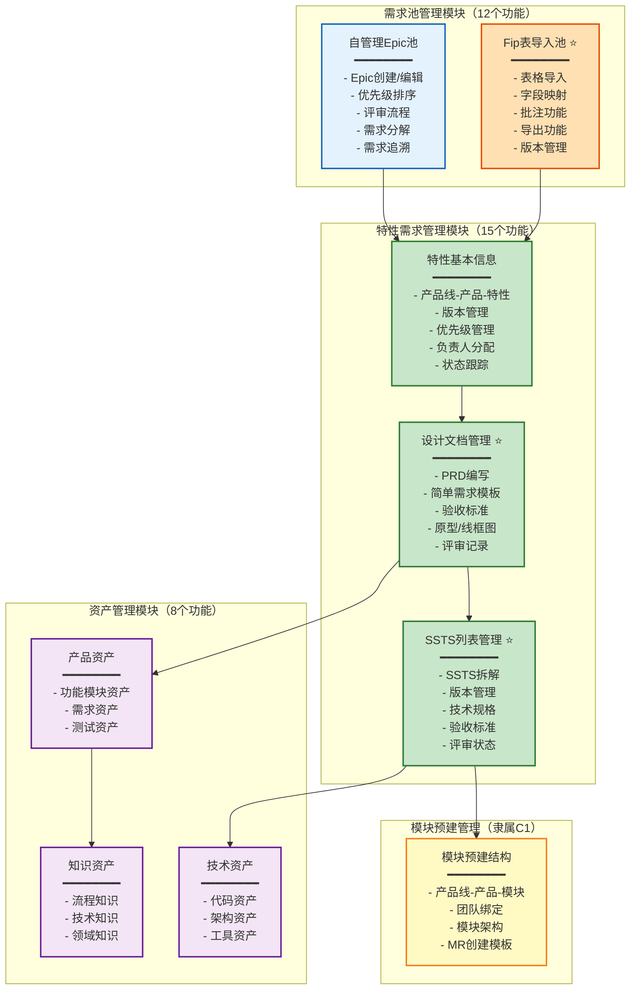
```mermaid
graph TB
    subgraph "需求池管理模块（12个功能）"
        RP1[自管理Epic池<br/>━━━━━━━━<br/>- Epic创建/编辑<br/>- 优先级排序<br/>- 评审流程<br/>- 需求分解<br/>- 需求追溯]
        
        RP2[Fip表导入池 ⭐<br/>━━━━━━━━<br/>- 表格导入<br/>- 字段映射<br/>- 批注功能<br/>- 导出功能<br/>- 版本管理]
    end
    
    subgraph "特性需求管理模块（15个功能）"
        FM1[特性基本信息<br/>━━━━━━━━<br/>- 产品线-产品-特性<br/>- 版本管理<br/>- 优先级管理<br/>- 负责人分配<br/>- 状态跟踪]
        
        FM2[设计文档管理 ⭐<br/>━━━━━━━━<br/>- PRD编写<br/>- 简单需求模板<br/>- 验收标准<br/>- 原型/线框图<br/>- 评审记录]
        
        FM3[SSTS列表管理 ⭐<br/>━━━━━━━━<br/>- SSTS拆解<br/>- 版本管理<br/>- 技术规格<br/>- 验收标准<br/>- 评审状态]
    end
    
    subgraph "模块预建管理（隶属C1）"
        MP[模块预建结构<br/>━━━━━━━━<br/>- 产品线-产品-模块<br/>- 团队绑定<br/>- 模块架构<br/>- MR创建模板]
    end
    
    subgraph "资产管理模块（8个功能）"
        AM1[产品资产<br/>━━━━━━━━<br/>- 功能模块资产<br/>- 需求资产<br/>- 测试资产]
        
        AM2[技术资产<br/>━━━━━━━━<br/>- 代码资产<br/>- 架构资产<br/>- 工具资产]
        
        AM3[知识资产<br/>━━━━━━━━<br/>- 流程知识<br/>- 技术知识<br/>- 领域知识]
    end
    
    RP1 --> FM1
    RP2 --> FM1
    
    FM1 --> FM2
    FM2 --> FM3
    
    FM3 --> MP
    
    FM2 --> AM1
    FM3 --> AM2
    AM1 --> AM3
    
    style RP1 fill:#E3F2FD,stroke:#1565C0,stroke-width:2px
    style RP2 fill:#FFE0B2,stroke:#E65100,stroke-width:2px
    style FM1 fill:#C8E6C9,stroke:#2E7D32,stroke-width:2px
    style FM2 fill:#C8E6C9,stroke:#2E7D32,stroke-width:2px
    style FM3 fill:#C8E6C9,stroke:#2E7D32,stroke-width:2px
    style MP fill:#FFF9C4,stroke:#F57F17,stroke-width:2px
    style AM1 fill:#F3E5F5,stroke:#6A1B9A,stroke-width:2px
    style AM2 fill:#F3E5F5,stroke:#6A1B9A,stroke-width:2px
    style AM3 fill:#F3E5F5,stroke:#6A1B9A,stroke-width:2px
```

**核心能力**（35个功能）:
1. **需求池管理**（12个）- 自管理Epic池 + Fip表导入池
2. **特性需求管理**（15个）- 特性三级组成
3. **资产管理**（8个）- 产品资产、技术资产、知识资产

**V11.0核心变更** ⭐:
- 新增需求池双模式
- 特性三级组成（基本信息 + 设计文档 + SSTS列表）
- 资产管理合并到C1
- 模块预建机制

**核心流程**: 需求池 → 特性需求 → SSTS拆解 → 模块预建 → MR创建

**参考文档**: 详见 `capability-solutions/C1-产品需求能力方案.md`

---

### 6.3 C2领域产品项目能力方案

**核心定位**: 管理领域产品项目全生命周期，从项目创建到交付的端到端管理

**详细方案文档**: `capability-solutions/C2-领域产品项目能力方案.md`（引用详细设计700行）

#### 能力架构图

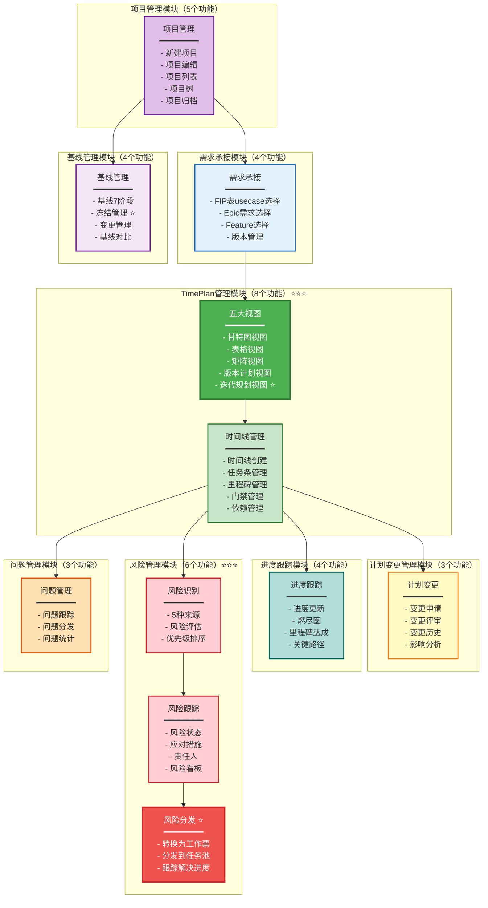
```mermaid
graph TB
    subgraph "项目管理模块（5个功能）"
        PM[项目管理<br/>━━━━━━━━<br/>- 新建项目<br/>- 项目编辑<br/>- 项目列表<br/>- 项目树<br/>- 项目归档]
    end
    
    subgraph "TimePlan管理模块（8个功能）⭐⭐⭐"
        TP1[五大视图<br/>━━━━━━━━<br/>- 甘特图视图<br/>- 表格视图<br/>- 矩阵视图<br/>- 版本计划视图<br/>- 迭代规划视图 ⭐]
        
        TP2[时间线管理<br/>━━━━━━━━<br/>- 时间线创建<br/>- 任务条管理<br/>- 里程碑管理<br/>- 门禁管理<br/>- 依赖管理]
    end
    
    subgraph "需求承接模块（4个功能）"
        RC[需求承接<br/>━━━━━━━━<br/>- FIP表usecase选择<br/>- Epic需求选择<br/>- Feature选择<br/>- 版本管理]
    end
    
    subgraph "计划变更管理模块（3个功能）"
        CM[计划变更<br/>━━━━━━━━<br/>- 变更申请<br/>- 变更评审<br/>- 变更历史<br/>- 影响分析]
    end
    
    subgraph "进度跟踪模块（4个功能）"
        PT[进度跟踪<br/>━━━━━━━━<br/>- 进度更新<br/>- 燃尽图<br/>- 里程碑达成<br/>- 关键路径]
    end
    
    subgraph "风险管理模块（6个功能）⭐⭐⭐"
        RM1[风险识别<br/>━━━━━━━━<br/>- 5种来源<br/>- 风险评估<br/>- 优先级排序]
        
        RM2[风险跟踪<br/>━━━━━━━━<br/>- 风险状态<br/>- 应对措施<br/>- 责任人<br/>- 风险看板]
        
        RM3[风险分发 ⭐<br/>━━━━━━━━<br/>- 转换为工作票<br/>- 分发到任务池<br/>- 跟踪解决进度]
    end
    
    subgraph "问题管理模块（3个功能）"
        IM[问题管理<br/>━━━━━━━━<br/>- 问题跟踪<br/>- 问题分发<br/>- 问题统计]
    end
    
    subgraph "基线管理模块（4个功能）"
        BM[基线管理<br/>━━━━━━━━<br/>- 基线7阶段<br/>- 冻结管理 ⭐<br/>- 变更管理<br/>- 基线对比]
    end
    
    PM --> RC
    RC --> TP1
    TP1 --> TP2
    
    TP2 --> CM
    TP2 --> PT
    
    TP2 --> RM1
    RM1 --> RM2
    RM2 --> RM3
    
    TP2 --> IM
    
    PM --> BM
    
    style PM fill:#E1BEE7,stroke:#6A1B9A,stroke-width:2px
    style TP1 fill:#4CAF50,stroke:#2E7D32,stroke-width:3px,color:#fff
    style TP2 fill:#C8E6C9,stroke:#2E7D32,stroke-width:2px
    style RC fill:#E3F2FD,stroke:#1565C0,stroke-width:2px
    style CM fill:#FFF9C4,stroke:#F57F17,stroke-width:2px
    style PT fill:#B2DFDB,stroke:#00695C,stroke-width:2px
    style RM1 fill:#FFCDD2,stroke:#C62828,stroke-width:2px
    style RM2 fill:#FFCDD2,stroke:#C62828,stroke-width:2px
    style RM3 fill:#EF5350,stroke:#C62828,stroke-width:3px,color:#fff
    style IM fill:#FFE0B2,stroke:#E65100,stroke-width:2px
    style BM fill:#F3E5F5,stroke:#6A1B9A,stroke-width:2px
```

**核心能力**（37个功能）:
1. **项目管理**（5个）- 新建、编辑、删除、列表、项目树
2. **TimePlan管理**（8个）⭐ - 五大视图、时间线、任务、依赖管理
3. **需求承接**（4个）- FIP表、Epic、Feature选择、版本管理
4. **计划变更管理**（3个）- 变更申请、评审、历史
5. **进度跟踪**（4个）- 进度更新、燃尽图、里程碑、关键路径
6. **风险管理**（6个）⭐ - 识别、跟踪、应对、分发、看板、统计
7. **问题管理**（3个）- 跟踪、分发、统计
8. **基线管理**（4个）- 7阶段、冻结、变更、对比

**V11.0核心亮点** ⭐⭐⭐⭐⭐:
- **TimePlan五大视图**（甘特图/表格/矩阵/版本/迭代）
- **风险管理闭环**（识别→跟踪→应对→分发到任务池）
- **迭代规划视图**（产品-模块-迭代矩阵，MR拖拽）

**详细设计**: `C2-领域产品项目能力域详细设计-V11.0.md`（700行完整设计）

**参考文档**: 详见 `capability-solutions/C2-领域产品项目能力方案.md`

---

### 6.4 C3产品迭代能力方案

**核心定位**: 管理产品迭代的规划和执行，包括PI规划、Sprint管理、工作票管理

**详细方案文档**: `capability-solutions/C3-产品迭代能力方案.md`

#### 能力架构图

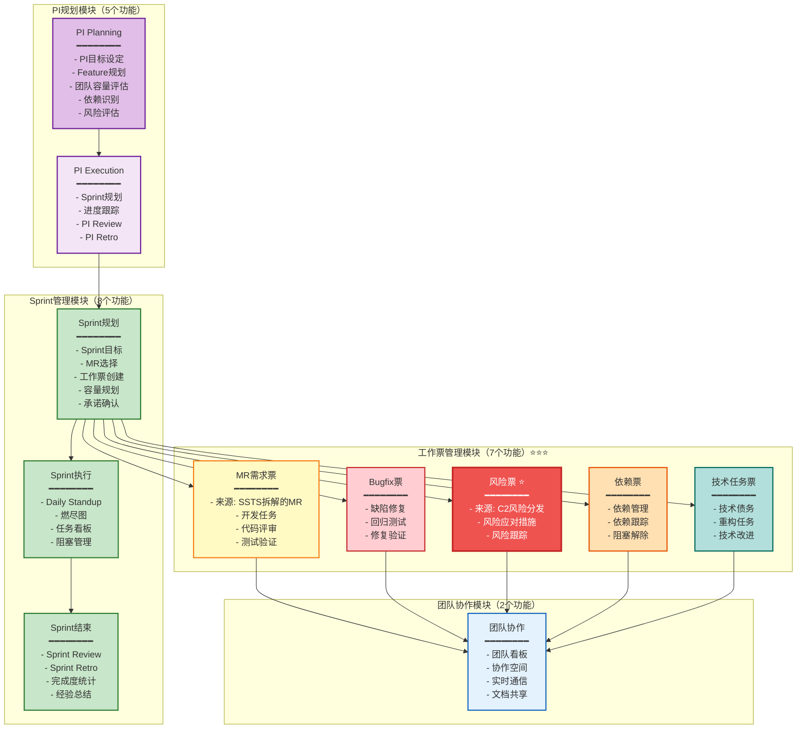
```mermaid
graph TB
    subgraph "PI规划模块（5个功能）"
        PI1[PI Planning<br/>━━━━━━━━<br/>- PI目标设定<br/>- Feature规划<br/>- 团队容量评估<br/>- 依赖识别<br/>- 风险评估]
        
        PI2[PI Execution<br/>━━━━━━━━<br/>- Sprint规划<br/>- 进度跟踪<br/>- PI Review<br/>- PI Retro]
    end
    
    subgraph "Sprint管理模块（8个功能）"
        SP1[Sprint规划<br/>━━━━━━━━<br/>- Sprint目标<br/>- MR选择<br/>- 工作票创建<br/>- 容量规划<br/>- 承诺确认]
        
        SP2[Sprint执行<br/>━━━━━━━━<br/>- Daily Standup<br/>- 燃尽图<br/>- 任务看板<br/>- 阻塞管理]
        
        SP3[Sprint结束<br/>━━━━━━━━<br/>- Sprint Review<br/>- Sprint Retro<br/>- 完成度统计<br/>- 经验总结]
    end
    
    subgraph "工作票管理模块（7个功能）⭐⭐⭐"
        WT1[MR需求票<br/>━━━━━━━━<br/>- 来源: SSTS拆解的MR<br/>- 开发任务<br/>- 代码评审<br/>- 测试验证]
        
        WT2[Bugfix票<br/>━━━━━━━━<br/>- 缺陷修复<br/>- 回归测试<br/>- 修复验证]
        
        WT3[风险票 ⭐<br/>━━━━━━━━<br/>- 来源: C2风险分发<br/>- 风险应对措施<br/>- 风险跟踪]
        
        WT4[依赖票<br/>━━━━━━━━<br/>- 依赖管理<br/>- 依赖跟踪<br/>- 阻塞解除]
        
        WT5[技术任务票<br/>━━━━━━━━<br/>- 技术债务<br/>- 重构任务<br/>- 技术改进]
    end
    
    subgraph "团队协作模块（2个功能）"
        TC[团队协作<br/>━━━━━━━━<br/>- 团队看板<br/>- 协作空间<br/>- 实时通信<br/>- 文档共享]
    end
    
    PI1 --> PI2
    PI2 --> SP1
    
    SP1 --> SP2
    SP2 --> SP3
    
    SP1 --> WT1
    SP1 --> WT2
    SP1 --> WT3
    SP1 --> WT4
    SP1 --> WT5
    
    WT1 --> TC
    WT2 --> TC
    WT3 --> TC
    WT4 --> TC
    WT5 --> TC
    
    style PI1 fill:#E1BEE7,stroke:#6A1B9A,stroke-width:2px
    style PI2 fill:#F3E5F5,stroke:#6A1B9A,stroke-width:2px
    style SP1 fill:#C8E6C9,stroke:#2E7D32,stroke-width:2px
    style SP2 fill:#C8E6C9,stroke:#2E7D32,stroke-width:2px
    style SP3 fill:#C8E6C9,stroke:#2E7D32,stroke-width:2px
    style WT1 fill:#FFF9C4,stroke:#F57F17,stroke-width:2px
    style WT2 fill:#FFCDD2,stroke:#C62828,stroke-width:2px
    style WT3 fill:#EF5350,stroke:#C62828,stroke-width:3px,color:#fff
    style WT4 fill:#FFE0B2,stroke:#E65100,stroke-width:2px
    style WT5 fill:#B2DFDB,stroke:#00695C,stroke-width:2px
    style TC fill:#E3F2FD,stroke:#1565C0,stroke-width:2px
```

**核心能力**（22个功能）:
1. **PI规划**（5个）- Program Increment规划、容量评估
2. **Sprint管理**（8个）- Sprint规划、Daily Standup、Sprint Review/Retro
3. **工作票管理**（7个）⭐ - 5种工作票类型管理
4. **团队协作**（2个）- 团队看板、协作空间

**V11.0核心变更** ⭐:
- 合并原C3规划协调 + C4迭代执行
- 工作票统一管理（MR需求、Bugfix、风险、依赖、技术任务）
- 风险票从C2风险管理分发而来

**核心流程**: PI Planning → Sprint规划 → 工作票管理 → Sprint执行 → Sprint Review/Retro

**参考文档**: 详见 `capability-solutions/C3-产品迭代能力方案.md`

---

### 6.5 C4测试质量能力方案

**核心定位**: 管理测试和质量保证，包括测试管理、缺陷管理、质量门禁

**详细方案文档**: `capability-solutions/C4-测试质量能力方案.md`

#### 能力架构图

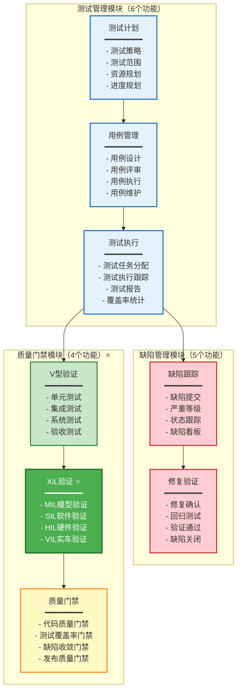
```mermaid
graph TB
    subgraph "测试管理模块（6个功能）"
        TM1[测试计划<br/>━━━━━━━━<br/>- 测试策略<br/>- 测试范围<br/>- 资源规划<br/>- 进度规划]
        
        TM2[用例管理<br/>━━━━━━━━<br/>- 用例设计<br/>- 用例评审<br/>- 用例执行<br/>- 用例维护]
        
        TM3[测试执行<br/>━━━━━━━━<br/>- 测试任务分配<br/>- 测试执行跟踪<br/>- 测试报告<br/>- 覆盖率统计]
    end
    
    subgraph "缺陷管理模块（5个功能）"
        DM1[缺陷跟踪<br/>━━━━━━━━<br/>- 缺陷提交<br/>- 严重等级<br/>- 状态跟踪<br/>- 缺陷看板]
        
        DM2[修复验证<br/>━━━━━━━━<br/>- 修复确认<br/>- 回归测试<br/>- 验证通过<br/>- 缺陷关闭]
    end
    
    subgraph "质量门禁模块（4个功能）⭐"
        QG1[V型验证<br/>━━━━━━━━<br/>- 单元测试<br/>- 集成测试<br/>- 系统测试<br/>- 验收测试]
        
        QG2[XiL验证 ⭐<br/>━━━━━━━━<br/>- MIL模型验证<br/>- SIL软件验证<br/>- HIL硬件验证<br/>- VIL实车验证]
        
        QG3[质量门禁<br/>━━━━━━━━<br/>- 代码质量门禁<br/>- 测试覆盖率门禁<br/>- 缺陷收敛门禁<br/>- 发布质量门禁]
    end
    
    TM1 --> TM2
    TM2 --> TM3
    
    TM3 --> DM1
    DM1 --> DM2
    
    TM3 --> QG1
    QG1 --> QG2
    QG2 --> QG3
    
    style TM1 fill:#E3F2FD,stroke:#1565C0,stroke-width:2px
    style TM2 fill:#E3F2FD,stroke:#1565C0,stroke-width:2px
    style TM3 fill:#E3F2FD,stroke:#1565C0,stroke-width:2px
    style DM1 fill:#FFCDD2,stroke:#C62828,stroke-width:2px
    style DM2 fill:#FFCDD2,stroke:#C62828,stroke-width:2px
    style QG1 fill:#C8E6C9,stroke:#2E7D32,stroke-width:2px
    style QG2 fill:#4CAF50,stroke:#2E7D32,stroke-width:3px,color:#fff
    style QG3 fill:#FFF9C4,stroke:#F57F17,stroke-width:2px
```

**核心能力**（15个功能）:
1. **测试管理**（6个）- 测试计划、用例管理、测试执行
2. **缺陷管理**（5个）- 缺陷跟踪、修复验证
3. **质量门禁**（4个）- V型验证、XiL验证

**核心亮点** ⭐:
- **XiL四级验证**: MIL → SIL → HIL → VIL完整验证链路
- **质量门禁**: 代码质量、测试覆盖率、缺陷收敛三重保障
- **V型验证**: 从单元到验收的完整测试体系

**参考文档**: 详见 `capability-solutions/C4-测试质量能力方案.md`

---

### 6.6 C5集成交付能力方案

**核心定位**: 管理构建、发布和制品，包括构建管理、发布管理、制品管理

**详细方案文档**: `capability-solutions/C5-集成交付能力方案.md`

#### 能力架构图

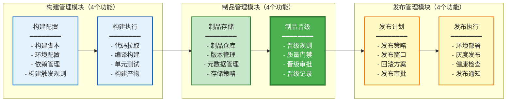
```mermaid
graph LR
    subgraph "构建管理模块（4个功能）"
        BM1[构建配置<br/>━━━━━━━━<br/>- 构建脚本<br/>- 环境配置<br/>- 依赖管理<br/>- 构建触发规则]
        
        BM2[构建执行<br/>━━━━━━━━<br/>- 代码拉取<br/>- 编译构建<br/>- 单元测试<br/>- 构建产物]
    end
    
    subgraph "发布管理模块（4个功能）"
        RM1[发布计划<br/>━━━━━━━━<br/>- 发布策略<br/>- 发布窗口<br/>- 回滚方案<br/>- 发布审批]
        
        RM2[发布执行<br/>━━━━━━━━<br/>- 环境部署<br/>- 灰度发布<br/>- 健康检查<br/>- 发布通知]
    end
    
    subgraph "制品管理模块（4个功能）"
        AM1[制品存储<br/>━━━━━━━━<br/>- 制品仓库<br/>- 版本管理<br/>- 元数据管理<br/>- 存储策略]
        
        AM2[制品晋级<br/>━━━━━━━━<br/>- 晋级规则<br/>- 质量门禁<br/>- 晋级审批<br/>- 晋级记录]
    end
    
    BM1 --> BM2
    BM2 --> AM1
    
    AM1 --> AM2
    AM2 --> RM1
    
    RM1 --> RM2
    
    style BM1 fill:#E3F2FD,stroke:#1565C0,stroke-width:2px
    style BM2 fill:#E3F2FD,stroke:#1565C0,stroke-width:2px
    style AM1 fill:#C8E6C9,stroke:#2E7D32,stroke-width:2px
    style AM2 fill:#4CAF50,stroke:#2E7D32,stroke-width:3px,color:#fff
    style RM1 fill:#FFF9C4,stroke:#F57F17,stroke-width:2px
    style RM2 fill:#FFF9C4,stroke:#F57F17,stroke-width:2px
```

**核心能力**（12个功能）:
1. **构建管理**（4个）- 构建配置、构建执行
2. **发布管理**（4个）- 发布计划、发布执行
3. **制品管理**（4个）- 制品存储、制品晋级

**核心流程**: 代码提交 → 构建 → 制品存储 → 制品晋级 → 发布计划 → 发布执行

**核心亮点** ⭐:
- **制品晋级**: DEV → TEST → UAT → PROD多环境晋级
- **灰度发布**: 蓝绿部署、金丝雀发布
- **质量门禁**: 晋级前的自动化质量检查

**参考文档**: 详见 `capability-solutions/C5-集成交付能力方案.md`

---

### 6.7 C6价值度量能力方案

**核心定位**: 提供效能度量和价值分析，包括效能度量、质量分析、趋势预测

**详细方案文档**: `capability-solutions/C6-价值度量能力方案.md`

#### 能力架构图

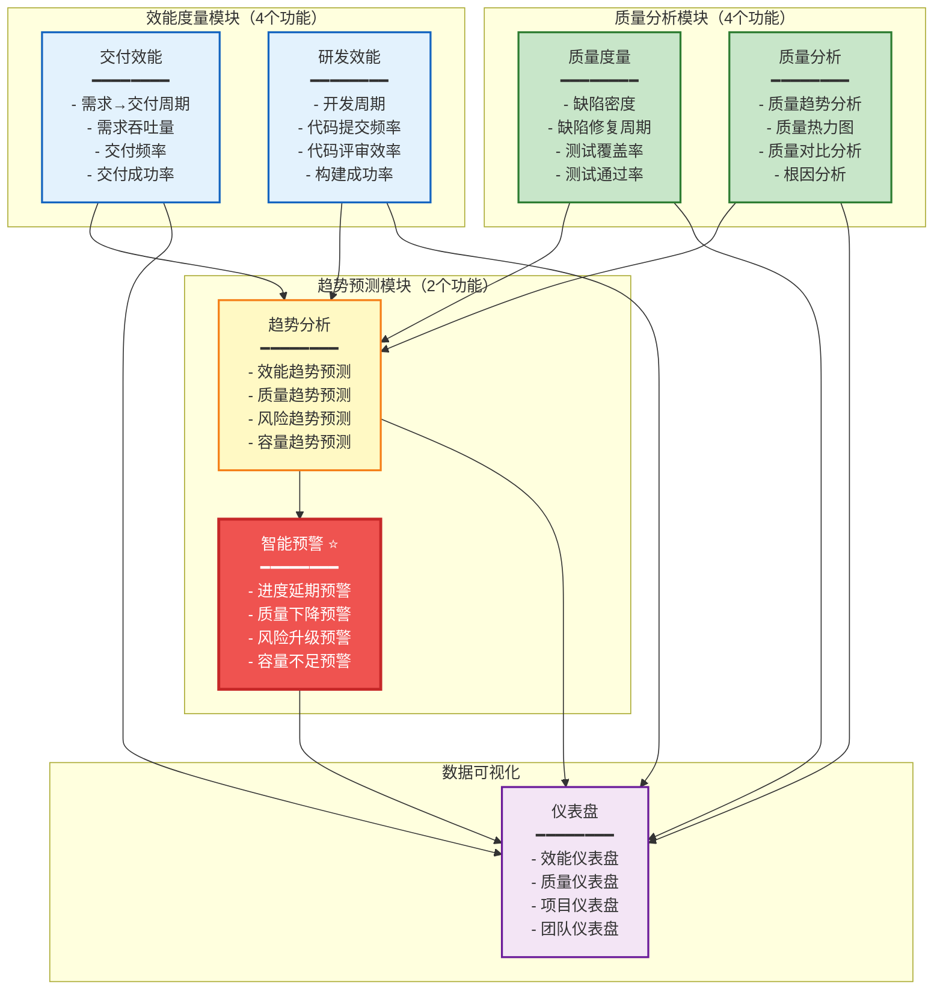
```mermaid
graph TB
    subgraph "效能度量模块（4个功能）"
        EM1[交付效能<br/>━━━━━━━━<br/>- 需求→交付周期<br/>- 需求吞吐量<br/>- 交付频率<br/>- 交付成功率]
        
        EM2[研发效能<br/>━━━━━━━━<br/>- 开发周期<br/>- 代码提交频率<br/>- 代码评审效率<br/>- 构建成功率]
    end
    
    subgraph "质量分析模块（4个功能）"
        QA1[质量度量<br/>━━━━━━━━<br/>- 缺陷密度<br/>- 缺陷修复周期<br/>- 测试覆盖率<br/>- 测试通过率]
        
        QA2[质量分析<br/>━━━━━━━━<br/>- 质量趋势分析<br/>- 质量热力图<br/>- 质量对比分析<br/>- 根因分析]
    end
    
    subgraph "趋势预测模块（2个功能）"
        TP1[趋势分析<br/>━━━━━━━━<br/>- 效能趋势预测<br/>- 质量趋势预测<br/>- 风险趋势预测<br/>- 容量趋势预测]
        
        TP2[智能预警 ⭐<br/>━━━━━━━━<br/>- 进度延期预警<br/>- 质量下降预警<br/>- 风险升级预警<br/>- 容量不足预警]
    end
    
    subgraph "数据可视化"
        DV[仪表盘<br/>━━━━━━━━<br/>- 效能仪表盘<br/>- 质量仪表盘<br/>- 项目仪表盘<br/>- 团队仪表盘]
    end
    
    EM1 --> TP1
    EM2 --> TP1
    
    QA1 --> TP1
    QA2 --> TP1
    
    TP1 --> TP2
    
    EM1 --> DV
    EM2 --> DV
    QA1 --> DV
    QA2 --> DV
    TP1 --> DV
    TP2 --> DV
    
    style EM1 fill:#E3F2FD,stroke:#1565C0,stroke-width:2px
    style EM2 fill:#E3F2FD,stroke:#1565C0,stroke-width:2px
    style QA1 fill:#C8E6C9,stroke:#2E7D32,stroke-width:2px
    style QA2 fill:#C8E6C9,stroke:#2E7D32,stroke-width:2px
    style TP1 fill:#FFF9C4,stroke:#F57F17,stroke-width:2px
    style TP2 fill:#EF5350,stroke:#C62828,stroke-width:3px,color:#fff
    style DV fill:#F3E5F5,stroke:#6A1B9A,stroke-width:2px
```

**核心能力**（10个功能）:
1. **效能度量**（4个）- 交付周期、需求吞吐量
2. **质量分析**（4个）- 缺陷密度、测试覆盖率
3. **趋势预测**（2个）- 趋势分析、智能预警

**核心亮点** ⭐:
- **智能预警**: 基于历史数据和趋势的智能预警机制
- **全景仪表盘**: 效能、质量、项目、团队四维度可视化
- **根因分析**: 质量问题的深度根因分析

**参考文档**: 详见 `capability-solutions/C6-价值度量能力方案.md`

---

### 6.8 C7 CICDCT能力方案

**核心定位**: 提供持续集成和持续交付能力，包括CI/CD流水线、自动化测试

**详细方案文档**: `capability-solutions/C7-CICDCT能力方案.md`

#### 能力架构图

```mermaid
graph LR
    subgraph "CI持续集成（2个功能）"
        CI1[代码集成<br/>━━━━━━━━<br/>- 代码提交触发<br/>- 代码检出<br/>- 静态代码检查<br/>- 依赖管理]
        
        CI2[自动构建<br/>━━━━━━━━<br/>- 编译构建<br/>- 单元测试<br/>- 代码覆盖率<br/>- 构建报告]
    end
    
    subgraph "CD持续交付（2个功能）"
        CD1[制品部署<br/>━━━━━━━━<br/>- 环境准备<br/>- 制品部署<br/>- 配置管理<br/>- 健康检查]
        
        CD2[发布策略<br/>━━━━━━━━<br/>- 蓝绿部署<br/>- 金丝雀发布<br/>- 滚动发布<br/>- 一键回滚]
    end
    
    subgraph "CT持续测试（4个功能）"
        CT1[自动化测试<br/>━━━━━━━━<br/>- API测试<br/>- UI测试<br/>- 性能测试<br/>- 安全测试]
        
        CT2[测试编排<br/>━━━━━━━━<br/>- 测试套件管理<br/>- 测试并行执行<br/>- 测试数据管理<br/>- 测试报告]
    end
    
    CI1 --> CI2
    CI2 --> CT1
    CT1 --> CT2
    
    CI2 --> CD1
    CT2 --> CD1
    CD1 --> CD2
    
    style CI1 fill:#E3F2FD,stroke:#1565C0,stroke-width:2px
    style CI2 fill:#E3F2FD,stroke:#1565C0,stroke-width:2px
    style CD1 fill:#C8E6C9,stroke:#2E7D32,stroke-width:2px
    style CD2 fill:#4CAF50,stroke:#2E7D32,stroke-width:3px,color:#fff
    style CT1 fill:#FFF9C4,stroke:#F57F17,stroke-width:2px
    style CT2 fill:#FFF9C4,stroke:#F57F17,stroke-width:2px
```

**核心能力**（8个功能）:
1. **CI/CD流水线**（4个）- 流水线配置、流水线执行
2. **自动化测试**（4个）- 测试自动化、测试集成

**V11.0变更** ⭐: 新增能力域，从C6 DevOps中分离

**核心流程**: 代码提交 → CI构建 → CT测试 → CD部署 → 健康检查

**核心亮点**:
- **完整的CICDCT**: 集成、交付、测试三位一体
- **多种发布策略**: 蓝绿、金丝雀、滚动发布
- **自动化测试**: API、UI、性能、安全全覆盖

**参考文档**: 详见 `capability-solutions/C7-CICDCT能力方案.md`

---

### 6.9 核心领域能力域

**核心定位**: 提供技术能力共享，支撑业务能力域

#### 6.9.1 可视化能力

**详细方案文档**: `capability-solutions/领域能力-可视化能力方案.md`

##### 能力架构图

```mermaid
graph TB
    subgraph "计划可视化"
        PV1[甘特图可视化 ⭐<br/>━━━━━━━━<br/>- 时间轴<br/>- 任务条<br/>- 里程碑<br/>- 门禁<br/>- 依赖连线<br/>- 今日线]
        
        PV2[表格视图<br/>━━━━━━━━<br/>- 任务列表<br/>- 筛选排序<br/>- 快速编辑<br/>- 批量操作]
        
        PV3[矩阵视图<br/>━━━━━━━━<br/>- 二维矩阵<br/>- 工作量分布<br/>- 资源分配<br/>- 优先级分布]
        
        PV4[版本计划视图<br/>━━━━━━━━<br/>- 版本时间线<br/>- 版本里程碑<br/>- 版本对比]
        
        PV5[迭代规划视图 ⭐<br/>━━━━━━━━<br/>- 产品-模块-迭代矩阵<br/>- MR卡片<br/>- 拖拽分配<br/>- 依赖可视化]
    end
    
    subgraph "规划可视化"
        PP1[PI Planning看板<br/>━━━━━━━━<br/>- Feature看板<br/>- 团队容量<br/>- 依赖墙<br/>- 风险看板]
        
        PP2[迭代看板<br/>━━━━━━━━<br/>- Sprint看板<br/>- 燃尽图<br/>- 速率图<br/>- 累积流图]
    end
    
    subgraph "拆解可视化"
        DV1[需求拆解图<br/>━━━━━━━━<br/>- Epic → Feature<br/>- Feature → SSTS<br/>- SSTS → MR<br/>- MR → 工作票]
        
        DV2[架构拆解图<br/>━━━━━━━━<br/>- 产品架构树<br/>- 模块依赖图<br/>- 技术架构图]
    end
    
    subgraph "协作可视化"
        CV1[工作票看板<br/>━━━━━━━━<br/>- 待办/进行中/完成<br/>- 泳道视图<br/>- WIP限制<br/>- 阻塞标识]
        
        CV2[团队看板<br/>━━━━━━━━<br/>- 团队工作量<br/>- 成员状态<br/>- 协作关系]
    end
    
    PV1 -.共享组件.-> PP1
    PV5 -.共享组件.-> PP2
    
    DV1 -.数据源.-> CV1
    
    style PV1 fill:#4CAF50,stroke:#2E7D32,stroke-width:3px,color:#fff
    style PV5 fill:#4CAF50,stroke:#2E7D32,stroke-width:3px,color:#fff
    style PV2 fill:#C8E6C9,stroke:#2E7D32,stroke-width:2px
    style PV3 fill:#C8E6C9,stroke:#2E7D32,stroke-width:2px
    style PV4 fill:#C8E6C9,stroke:#2E7D32,stroke-width:2px
    style PP1 fill:#E3F2FD,stroke:#1565C0,stroke-width:2px
    style PP2 fill:#E3F2FD,stroke:#1565C0,stroke-width:2px
    style DV1 fill:#FFF9C4,stroke:#F57F17,stroke-width:2px
    style DV2 fill:#FFF9C4,stroke:#F57F17,stroke-width:2px
    style CV1 fill:#FFCDD2,stroke:#C62828,stroke-width:2px
    style CV2 fill:#FFCDD2,stroke:#C62828,stroke-width:2px
```

**核心能力**:
- **计划可视化**: 甘特图、时间线、里程碑（TimePlan五大视图）⭐
- **规划可视化**: PI Planning看板、迭代规划矩阵
- **拆解可视化**: 需求拆解图、SSTS拆解图
- **协作可视化**: 工作票看板、Sprint看板、团队看板

**服务的业务能力域**: C1, C2, C3, C4, C5, C6

**核心组件**: TimePlan五大视图（详见C2能力域设计）

**参考文档**: 详见 `capability-solutions/领域能力-可视化能力方案.md`

---

#### 6.9.2 可追溯能力

**详细方案文档**: `capability-solutions/领域能力-可追溯能力方案.md`

##### 能力架构图

```mermaid
graph TB
    subgraph "项目树追溯"
        PT1[车型项目树<br/>━━━━━━━━<br/>车型 → 领域项目<br/>→ 产品版本<br/>→ 模块版本<br/>→ 基线]
        
        PT2[基线追溯<br/>━━━━━━━━<br/>- 基线内容<br/>- 需求快照<br/>- 制品清单<br/>- 变更历史]
    end
    
    subgraph "特性树追溯"
        FT1[特性树<br/>━━━━━━━━<br/>产品线 → 产品<br/>→ 特性 → SSTS<br/>→ MR → 工作票]
        
        FT2[需求追溯 ⭐<br/>━━━━━━━━<br/>- Epic → Feature<br/>- Feature → SSTS<br/>- SSTS → MR<br/>- MR → Code<br/>- Code → Test]
    end
    
    subgraph "产品树追溯"
        PT3[产品架构树<br/>━━━━━━━━<br/>产品线 → 产品<br/>→ 模块 → 组件]
        
        PT4[模块依赖追溯<br/>━━━━━━━━<br/>- 模块依赖关系<br/>- 接口依赖<br/>- 版本依赖]
    end
    
    subgraph "迭代版本树追溯"
        IT1[迭代树<br/>━━━━━━━━<br/>PI → Sprint<br/>→ 工作票<br/>→ 代码提交]
        
        IT2[版本树<br/>━━━━━━━━<br/>- 版本演进<br/>- 版本对比<br/>- 版本回溯]
    end
    
    subgraph "双向追溯"
        BT1[向上追溯<br/>━━━━━━━━<br/>代码 → 工作票<br/>→ MR → SSTS<br/>→ Feature → Epic]
        
        BT2[向下追溯<br/>━━━━━━━━<br/>Epic → Feature<br/>→ SSTS → MR<br/>→ 工作票 → 代码]
    end
    
    PT1 --> PT2
    FT1 --> FT2
    PT3 --> PT4
    IT1 --> IT2
    
    FT2 -.实现.-> BT1
    FT2 -.实现.-> BT2
    
    style PT1 fill:#E1BEE7,stroke:#6A1B9A,stroke-width:2px
    style PT2 fill:#F3E5F5,stroke:#6A1B9A,stroke-width:2px
    style FT1 fill:#C8E6C9,stroke:#2E7D32,stroke-width:2px
    style FT2 fill:#4CAF50,stroke:#2E7D32,stroke-width:3px,color:#fff
    style PT3 fill:#E3F2FD,stroke:#1565C0,stroke-width:2px
    style PT4 fill:#B3E5FC,stroke:#01579B,stroke-width:2px
    style IT1 fill:#FFF9C4,stroke:#F57F17,stroke-width:2px
    style IT2 fill:#FFE0B2,stroke:#E65100,stroke-width:2px
    style BT1 fill:#FFCDD2,stroke:#C62828,stroke-width:2px
    style BT2 fill:#FFCDD2,stroke:#C62828,stroke-width:2px
```

**核心能力**:
- **项目树**: 车型项目-领域项目-基线-产品版本-模块版本
- **特性树**: 产品线-产品-特性（完整需求追溯链路）⭐
- **产品树**: 产品-模块（产品架构可视化）
- **迭代版本树**: 迭代-版本（迭代演进历史）
- **双向追溯**: 向上追溯（代码→需求）、向下追溯（需求→代码）⭐

**服务的业务能力域**: C1, C2, C3, C4, C6

**核心价值**: 100%需求到代码的双向追溯

**参考文档**: 详见 `capability-solutions/领域能力-可追溯能力方案.md`

---

#### 6.9.3 集成能力

**详细方案文档**: `capability-solutions/领域能力-集成能力方案.md`

##### 能力架构图

```mermaid
graph TB
    subgraph "研发工具集成"
        DT1[代码管理集成<br/>━━━━━━━━<br/>- GitLab<br/>- GitHub<br/>- Gitee<br/>- 代码仓库管理<br/>- 代码提交同步]
        
        DT2[项目管理集成<br/>━━━━━━━━<br/>- Jira<br/>- Teambition<br/>- Tapd<br/>- 需求同步<br/>- 工作项同步]
        
        DT3[CI/CD集成<br/>━━━━━━━━<br/>- Jenkins<br/>- GitLab CI<br/>- GitHub Actions<br/>- 构建触发<br/>- 状态回传]
    end
    
    subgraph "数据集成"
        DA1[测试数据生成<br/>━━━━━━━━<br/>- 测试数据工厂<br/>- Mock数据生成<br/>- 数据脱敏<br/>- 数据清理]
        
        DA2[数据导入导出<br/>━━━━━━━━<br/>- Excel导入导出<br/>- CSV导入导出<br/>- JSON导入导出<br/>- 数据映射]
    end
    
    subgraph "办公协同集成"
        OA1[即时通讯集成<br/>━━━━━━━━<br/>- 钉钉<br/>- 企业微信<br/>- 飞书<br/>- 消息通知<br/>- 审批流程]
        
        OA2[文档协作集成<br/>━━━━━━━━<br/>- Confluence<br/>- 语雀<br/>- 腾讯文档<br/>- 文档同步]
    end
    
    subgraph "API开放平台"
        API1[RESTful API<br/>━━━━━━━━<br/>- API网关<br/>- API文档<br/>- API鉴权<br/>- API限流]
        
        API2[Webhook<br/>━━━━━━━━<br/>- 事件订阅<br/>- 消息推送<br/>- 重试机制<br/>- 日志追踪]
        
        API3[SSO单点登录<br/>━━━━━━━━<br/>- OAuth2.0<br/>- SAML<br/>- LDAP<br/>- CAS]
    end
    
    DT1 --> API1
    DT2 --> API1
    DT3 --> API2
    
    DA1 --> API1
    DA2 --> API1
    
    OA1 --> API2
    OA2 --> API1
    
    API1 --> API3
    API2 --> API3
    
    style DT1 fill:#E3F2FD,stroke:#1565C0,stroke-width:2px
    style DT2 fill:#E3F2FD,stroke:#1565C0,stroke-width:2px
    style DT3 fill:#E3F2FD,stroke:#1565C0,stroke-width:2px
    style DA1 fill:#C8E6C9,stroke:#2E7D32,stroke-width:2px
    style DA2 fill:#C8E6C9,stroke:#2E7D32,stroke-width:2px
    style OA1 fill:#FFF9C4,stroke:#F57F17,stroke-width:2px
    style OA2 fill:#FFF9C4,stroke:#F57F17,stroke-width:2px
    style API1 fill:#4CAF50,stroke:#2E7D32,stroke-width:3px,color:#fff
    style API2 fill:#FFCDD2,stroke:#C62828,stroke-width:2px
    style API3 fill:#F3E5F5,stroke:#6A1B9A,stroke-width:2px
```

**核心能力**:
- **研发工具集成**: GitLab、Jira、Jenkins（代码、需求、CI/CD）
- **数据集成**: 测试数据生成、Mock数据生成、数据导入导出
- **办公协同工具集成**: 钉钉、企业微信、飞书（消息通知、审批流程）
- **API开放平台**: RESTful API、Webhook、SSO（标准化集成接口）⭐

**服务的业务能力域**: C4, C5, C7

**核心价值**: 打通研发工具链，实现数据互通

**参考文档**: 详见 `capability-solutions/领域能力-集成能力方案.md`

---

#### 6.9.4 迁移能力

**详细方案文档**: `capability-solutions/领域能力-迁移能力方案.md`

##### 能力架构图

```mermaid
graph LR
    subgraph "线下数据迁移"
        OF1[Excel迁移<br/>━━━━━━━━<br/>- 需求Excel<br/>- 计划Excel<br/>- 资产Excel<br/>- 字段映射<br/>- 数据清洗]
        
        OF2[文档迁移<br/>━━━━━━━━<br/>- Word文档<br/>- PDF文档<br/>- PPT文档<br/>- 内容提取<br/>- 格式转换]
    end
    
    subgraph "工具数据导入"
        TI1[Jira导入 ⭐<br/>━━━━━━━━<br/>- Epic导入<br/>- Story导入<br/>- Task导入<br/>- 状态映射<br/>- 附件迁移]
        
        TI2[Confluence导入<br/>━━━━━━━━<br/>- 文档导入<br/>- 页面结构<br/>- 附件迁移<br/>- 链接转换]
        
        TI3[其它工具导入<br/>━━━━━━━━<br/>- Tapd导入<br/>- Teambition导入<br/>- GitLab Issues]
    end
    
    subgraph "分领域整理"
        DC1[需求数据整理<br/>━━━━━━━━<br/>- 需求分类<br/>- 需求去重<br/>- 需求关联<br/>- 版本归属]
        
        DC2[资产数据整理<br/>━━━━━━━━<br/>- 资产分类<br/>- 成熟度评估<br/>- 资产标签<br/>- 依赖分析]
        
        DC3[项目数据整理<br/>━━━━━━━━<br/>- 项目结构<br/>- 计划重建<br/>- 基线恢复]
    end
    
    subgraph "格式转换"
        FC1[文本格式转换<br/>━━━━━━━━<br/>- Markdown ↔ Word<br/>- Markdown ↔ PDF<br/>- HTML ↔ Markdown]
        
        FC2[数据格式转换 ⭐<br/>━━━━━━━━<br/>- Excel ↔ CSV<br/>- Excel ↔ JSON<br/>- CSV ↔ JSON<br/>- XML ↔ JSON]
    end
    
    OF1 --> DC1
    OF2 --> DC1
    
    TI1 --> DC1
    TI2 --> DC2
    TI3 --> DC3
    
    DC1 --> FC2
    DC2 --> FC2
    DC3 --> FC2
    
    OF2 --> FC1
    
    style OF1 fill:#E3F2FD,stroke:#1565C0,stroke-width:2px
    style OF2 fill:#E3F2FD,stroke:#1565C0,stroke-width:2px
    style TI1 fill:#4CAF50,stroke:#2E7D32,stroke-width:3px,color:#fff
    style TI2 fill:#C8E6C9,stroke:#2E7D32,stroke-width:2px
    style TI3 fill:#C8E6C9,stroke:#2E7D32,stroke-width:2px
    style DC1 fill:#FFF9C4,stroke:#F57F17,stroke-width:2px
    style DC2 fill:#FFF9C4,stroke:#F57F17,stroke-width:2px
    style DC3 fill:#FFF9C4,stroke:#F57F17,stroke-width:2px
    style FC1 fill:#FFCDD2,stroke:#C62828,stroke-width:2px
    style FC2 fill:#EF5350,stroke:#C62828,stroke-width:3px,color:#fff
```

**核心能力**:
- **线下数据迁移**: Excel迁移、文档迁移（支持历史数据导入）
- **其它工具数据导入**: Jira导入 ⭐、Confluence导入（平滑迁移）
- **分领域数据整理**: 需求数据整理、资产数据整理、项目数据整理
- **多格式转换**: Excel/CSV/JSON、Markdown/Word/PDF（灵活转换）⭐

**服务的业务能力域**: C1

**核心场景** ⭐:
- **Fip表导入**: 车型FIP表Excel导入到需求池
- **历史需求迁移**: Jira历史需求迁移到平台
- **文档迁移**: Confluence文档迁移到知识库

**参考文档**: 详见 `capability-solutions/领域能力-迁移能力方案.md`

---

#### 6.9.5 模版能力

**详细方案文档**: `capability-solutions/领域能力-模版能力方案.md`

##### 能力架构图

```mermaid
graph TB
    subgraph "组织团队模板"
        OT1[组织结构模板<br/>━━━━━━━━<br/>- 部门层级<br/>- 角色定义<br/>- 权限配置<br/>- 审批流程]
        
        OT2[团队配置模板<br/>━━━━━━━━<br/>- 团队组成<br/>- 成员角色<br/>- 技能矩阵<br/>- 容量配置]
    end
    
    subgraph "业务产品架构模板"
        BA1[产品线模板<br/>━━━━━━━━<br/>- 产品线结构<br/>- 产品定义<br/>- 特性分类<br/>- 版本规划]
        
        BA2[产品模块模板 ⭐<br/>━━━━━━━━<br/>- 模块架构<br/>- 模块定义<br/>- 接口规范<br/>- 团队绑定]
    end
    
    subgraph "计划内容模板"
        PC1[项目计划模板<br/>━━━━━━━━<br/>- 项目WBS<br/>- 里程碑模板<br/>- 门禁模板<br/>- 风险清单模板]
        
        PC2[TimePlan模板 ⭐<br/>━━━━━━━━<br/>- 时间线模板<br/>- 任务条模板<br/>- 依赖关系模板<br/>- 基线模板]
    end
    
    subgraph "迭代流程模板"
        IP1[Sprint看板模板<br/>━━━━━━━━<br/>- 泳道配置<br/>- 状态流转<br/>- WIP限制<br/>- DoD定义]
        
        IP2[工作流模板<br/>━━━━━━━━<br/>- 状态机<br/>- 流转规则<br/>- 审批节点<br/>- 通知规则]
    end
    
    subgraph "文档模板"
        DT1[PRD文档模板 ⭐<br/>━━━━━━━━<br/>- PRD章节结构<br/>- 内容规范<br/>- 评审Checklist<br/>- 验收标准模板]
        
        DT2[技术文档模板<br/>━━━━━━━━<br/>- 设计方案模板<br/>- 接口文档模板<br/>- 测试报告模板<br/>- 发布说明模板]
    end
    
    OT1 --> BA1
    OT2 --> BA2
    
    BA1 --> PC1
    BA2 --> PC2
    
    PC1 --> IP1
    PC2 --> IP2
    
    BA1 --> DT1
    PC1 --> DT1
    IP1 --> DT2
    
    style OT1 fill:#E1BEE7,stroke:#6A1B9A,stroke-width:2px
    style OT2 fill:#F3E5F5,stroke:#6A1B9A,stroke-width:2px
    style BA1 fill:#E3F2FD,stroke:#1565C0,stroke-width:2px
    style BA2 fill:#4CAF50,stroke:#2E7D32,stroke-width:3px,color:#fff
    style PC1 fill:#C8E6C9,stroke:#2E7D32,stroke-width:2px
    style PC2 fill:#4CAF50,stroke:#2E7D32,stroke-width:3px,color:#fff
    style IP1 fill:#FFF9C4,stroke:#F57F17,stroke-width:2px
    style IP2 fill:#FFE0B2,stroke:#E65100,stroke-width:2px
    style DT1 fill:#EF5350,stroke:#C62828,stroke-width:3px,color:#fff
    style DT2 fill:#FFCDD2,stroke:#C62828,stroke-width:2px
```

**核心能力**:
- **组织团队模板**: 组织结构模板、团队配置模板
- **业务产品架构模板**: 产品线模板、产品模块模板 ⭐（预建机制）
- **计划内容模板**: 项目计划模板、TimePlan模板 ⭐（快速启动）
- **迭代看板流程模板**: Sprint看板模板、工作流模板
- **PRD文档模板**: PRD模板 ⭐、评审Checklist（标准化）

**服务的业务能力域**: C1, C2, C3, C5

**核心价值** ⭐:
- **标准化**: 统一组织标准和最佳实践
- **快速启动**: 基于模板快速创建项目和计划
- **最佳实践沉淀**: 将成功经验固化为模板

**参考文档**: 详见 `capability-solutions/领域能力-模版能力方案.md`

---

## 七、全景功能架构

### 7.1 分层功能架构全景（V11.0）

```mermaid
graph TB
    subgraph "核心业务能力域 - 139个功能"
        C1F["C1: 产品需求<br/>━━━━━━━━━━━━<br/>35个功能<br/>━━━━━━━━━━━━<br/>需求池管理（12）<br/>特性需求管理（15）<br/>资产管理（8）"]
        
        C2F["C2: 领域产品项目<br/>━━━━━━━━━━━━<br/>37个功能 ⭐<br/>━━━━━━━━━━━━<br/>项目管理（5）<br/>TimePlan管理（8）⭐<br/>需求承接（4）<br/>计划变更（3）<br/>进度跟踪（4）<br/>风险管理（6）⭐<br/>问题管理（3）<br/>基线管理（4）"]
        
        C3F["C3: 产品迭代<br/>━━━━━━━━━━━━<br/>22个功能<br/>━━━━━━━━━━━━<br/>PI规划（5）<br/>Sprint管理（8）<br/>工作票管理（7）⭐<br/>团队协作（2）"]
        
        C4F["C4: 测试质量<br/>━━━━━━━━━━━━<br/>15个功能<br/>━━━━━━━━━━━━<br/>测试管理（6）<br/>缺陷管理（5）<br/>质量门禁（4）"]
        
        C5F["C5: 集成交付<br/>━━━━━━━━━━━━<br/>12个功能<br/>━━━━━━━━━━━━<br/>构建管理（4）<br/>发布管理（4）<br/>制品管理（4）"]
        
        C6F["C6: 价值度量<br/>━━━━━━━━━━━━<br/>10个功能<br/>━━━━━━━━━━━━<br/>效能度量（4）<br/>质量分析（4）<br/>趋势预测（2）"]
        
        C7F["C7: CICDCT<br/>━━━━━━━━━━━━<br/>8个功能 ⭐ NEW<br/>━━━━━━━━━━━━<br/>CI/CD流水线（4）<br/>自动化测试（4）"]
    end
    
    subgraph "核心领域能力域 - 技术能力共享 ⭐"
        DC1F["可视化能力<br/>━━━━━━━━━━━━<br/>计划可视化<br/>规划可视化<br/>拆解可视化<br/>协作可视化"]
        
        DC2F["可追溯能力<br/>━━━━━━━━━━━━<br/>项目树<br/>特性树<br/>产品树<br/>迭代版本树"]
        
        DC3F["集成能力<br/>━━━━━━━━━━━━<br/>研发工具集成<br/>数据生成工具<br/>办公协同集成<br/>API开放"]
        
        DC4F["迁移能力<br/>━━━━━━━━━━━━<br/>线下数据迁移<br/>工具数据导入<br/>分领域整理<br/>多格式转换"]
        
        DC5F["模版能力<br/>━━━━━━━━━━━━<br/>组织团队模板<br/>产品架构模板<br/>计划内容模板<br/>迭代流程模板<br/>PRD文档模板"]
    end
    
    C1F --> C2F
    C2F --> C3F
    C3F --> C4F
    C4F --> C5F
    C5F --> C6F
    
    C1F -.使用.-> DC1F
    C1F -.使用.-> DC2F
    C1F -.使用.-> DC4F
    C1F -.使用.-> DC5F
    
    C2F -.使用.-> DC1F
    C2F -.使用.-> DC2F
    C2F -.使用.-> DC5F
    
    C3F -.使用.-> DC1F
    C3F -.使用.-> DC2F
    C3F -.使用.-> DC5F
    
    C4F -.使用.-> DC1F
    C4F -.使用.-> DC2F
    C4F -.使用.-> DC3F
    
    C5F -.使用.-> DC1F
    C5F -.使用.-> DC3F
    C5F -.使用.-> DC5F
    
    C6F -.使用.-> DC1F
    C6F -.使用.-> DC2F
    
    C7F -.使用.-> DC3F
    
    style C1F fill:#E3F2FD,stroke:#1565C0,stroke-width:2px
    style C2F fill:#C8E6C9,stroke:#2E7D32,stroke-width:2px
    style C3F fill:#FFF9C4,stroke:#F57F17,stroke-width:2px
    style C4F fill:#FFCDD2,stroke:#C62828,stroke-width:2px
    style C5F fill:#F3E5F5,stroke:#6A1B9A,stroke-width:2px
    style C6F fill:#FFE0B2,stroke:#E65100,stroke-width:2px
    style C7F fill:#B2DFDB,stroke:#00695C,stroke-width:2px
    
    style DC1F fill:#DCEDC8,stroke:#558B2F
    style DC2F fill:#F0F4C3,stroke:#827717
    style DC3F fill:#B3E5FC,stroke:#01579B
    style DC4F fill:#FFE0B2,stroke:#E65100
    style DC5F fill:#E1BEE7,stroke:#4A148C
```

### 7.2 全量特性清单：能力-场景-用户

#### 7.2.1 功能数量统计（V11.0）

| 能力域 | 功能数 | 优先级分布 | 说明 |
|--------|--------|-----------|------|
| **C1: 产品需求** | 35个 | P0: 20, P1: 15 | 需求池+特性+资产 |
| **C2: 领域产品项目** | 37个 | P0: 20, P1: 17 | TimePlan+风险+基线 |
| **C3: 产品迭代** | 22个 | P0: 15, P1: 7 | PI+Sprint+工作票 |
| **C4: 测试质量** | 15个 | P0: 10, P1: 5 | 测试+质量门禁 |
| **C5: 集成交付** | 12个 | P0: 8, P1: 4 | 构建+发布+制品 |
| **C6: 价值度量** | 10个 | P0: 4, P1: 6 | 效能+质量分析 |
| **C7: CICDCT** | 8个 | P0: 5, P1: 3 | CI/CD+自动化 |
| **总计** | **139个** | **P0: 82, P1: 57** | - |

#### 7.2.2 MVP版本规划（20-25个核心功能）

**目标**: 快速验证核心业务流程，8-10周

**功能清单**:

| 能力域 | MVP功能 | 数量 |
|--------|---------|------|
| **C1: 产品需求** | 自管理Epic池（创建/列表/评审）、Feature创建、SSTS拆解 | 5个 |
| **C2: 领域产品项目** | 项目创建、TimePlan甘特图视图、里程碑门禁、风险识别/跟踪 | 6个 |
| **C3: 产品迭代** | Sprint创建、工作票看板、MR需求票管理 | 4个 |
| **C4: 测试质量** | 测试用例管理、缺陷跟踪 | 2个 |
| **C5: 集成交付** | 制品管理、基本发布 | 2个 |
| **C6: 价值度量** | 基础进度看板 | 1个 |
| **领域能力** | 基础可视化（看板）、基础可追溯（链路查询）| 2个 |
| **总计** | - | **22个** |

#### 7.2.3 V1.0版本规划（55-65个功能）

**目标**: 核心业务闭环，16-20周

**新增功能**（在MVP基础上）:

| 能力域 | V1.0新增功能 | 数量 |
|--------|-------------|------|
| **C1: 产品需求** | Fip表导入池、PRD文档管理、资产管理基础 | +10个 |
| **C2: 领域产品项目** | TimePlan五大视图、计划变更管理、风险分发、基线管理 | +14个 |
| **C3: 产品迭代** | PI规划、Sprint Review/Retro、5种工作票类型 | +8个 |
| **C4: 测试质量** | 质量门禁、V型验证 | +8个 |
| **C5: 集成交付** | 构建管理、制品晋级 | +6个 |
| **C6: 价值度量** | 效能度量、质量分析 | +5个 |
| **C7: CICDCT** | 基础CI/CD流水线 | +3个 |
| **领域能力** | 完整可视化、完整可追溯、基础集成 | +6个 |
| **总计** | MVP 22个 + V1.0新增 60个 | **约82个（P0功能）** |

#### 7.2.4 V2.0版本规划（120个功能）

**目标**: 完整能力域覆盖

**新增功能**（在V1.0基础上）:

| 能力域 | V2.0新增功能 | 数量 |
|--------|-------------|------|
| **C1-C7** | P1优先级功能全部实现 | +57个 |
| **领域能力** | 完整集成能力、迁移能力、模版能力 | - |
| **总计** | **139个功能** | **P0+P1全覆盖** |

---

## 八、总结与参考

### 8.1 V11.0核心成果总结

#### 设计理念升级

| 维度 | V10.0 | V11.0 ⭐ | 核心价值 |
|------|-------|---------|---------|
| **需求管理** | Epic→Feature→MR | 需求池驱动（双模式）| 集中化入口，外部兼容 |
| **特性设计** | Feature基本信息 | 特性三级组成 | 完整设计闭环 |
| **模块管理** | 概念不清晰 | 模块预建机制 | 结构化、职责清晰 |
| **计划可视化** | 甘特图 | TimePlan五大视图 | 多角色、多场景支撑 |
| **风险管理** | 简单跟踪 | 风险管理闭环 | 与迭代执行无缝衔接 |
| **能力架构** | 8个独立能力域 | 能力双层抽象 | 技术能力共享复用 |

#### 功能规模

- **总功能数**: 139个（V10.0: 164个，优化聚焦）
- **MVP功能**: 22个（8-10周快速验证）
- **V1.0功能**: 约82个（16-20周核心闭环）
- **V2.0功能**: 139个（完整能力域）

#### 核心创新点（7个）

1. ⭐ 需求池双模式（自管理 + Fip表导入）
2. ⭐ 特性三级组成（基本信息 + 设计文档 + SSTS列表）
3. ⭐ 模块预建机制（MR关联预建Module）
4. ⭐ 工作票统一管理（5种类型）
5. ⭐ 能力双层抽象（业务能力域 + 领域能力域）
6. ⭐ TimePlan五大视图（甘特图/表格/矩阵/版本/迭代）
7. ⭐ 风险管理闭环（识别→跟踪→应对→分发）

### 8.2 核心文档引用

#### 领域模型设计文档

| 文档 | 路径 | 说明 |
|------|------|------|
| 三层需求模型 | `domain-models/5.1-三层需求模型.md` | 需求池+特性+模块+迭代 |
| 三层资产模型 | `domain-models/5.2-三层资产模型.md` | 产品+技术+知识资产 |
| 项目与基线模型 | `domain-models/5.3-项目与基线模型.md` | 项目层次+基线管理 |
| 三级计划体系 | `domain-models/5.4-三级计划体系架构.md` | 项目+产品+迭代计划 |
| 基线7阶段生命周期 | `domain-models/5.5-基线7阶段生命周期.md` | 规划→归档7阶段 |

#### 能力域方案文档

| 文档 | 路径 | 说明 |
|------|------|------|
| C1产品需求 | `capability-solutions/C1-产品需求能力方案.md` | 需求池+特性+资产（35个功能）|
| C2领域产品项目 | `capability-solutions/C2-领域产品项目能力方案.md` | TimePlan+风险+基线（37个功能）⭐ |
| C3产品迭代 | `capability-solutions/C3-产品迭代能力方案.md` | PI+Sprint+工作票（22个功能）|
| C4测试质量 | `capability-solutions/C4-测试质量能力方案.md` | 测试+质量门禁（15个功能）|
| C5集成交付 | `capability-solutions/C5-集成交付能力方案.md` | 构建+发布+制品（12个功能）|
| C6价值度量 | `capability-solutions/C6-价值度量能力方案.md` | 效能+质量分析（10个功能）|
| C7 CICDCT | `capability-solutions/C7-CICDCT能力方案.md` | CI/CD+自动化（8个功能）|
| 可视化能力 | `capability-solutions/领域能力-可视化能力方案.md` | 计划/规划/拆解/协作可视化 |
| 可追溯能力 | `capability-solutions/领域能力-可追溯能力方案.md` | 项目树/特性树/产品树/版本树 |
| 集成能力 | `capability-solutions/领域能力-集成能力方案.md` | 工具集成/API开放 |
| 迁移能力 | `capability-solutions/领域能力-迁移能力方案.md` | 数据迁移/格式转换 |
| 模版能力 | `capability-solutions/领域能力-模版能力方案.md` | 组织/产品/计划/流程模板 |

#### 详细设计文档

| 文档 | 路径 | 说明 |
|------|------|------|
| C2详细设计 | `C2-领域产品项目能力域详细设计-V11.0.md` | C2完整详细设计（700行）⭐⭐⭐⭐⭐ |
| V11.0完整方案 | `平台方案设计-V11.0-需求三层模型重构版.md` | V11.0核心设计（600行）⭐⭐⭐⭐⭐ |
| V11.0变更总结 | `../03-V11.0设计变更总结.md` | 核心变更速览（350行）⭐⭐⭐⭐ |
| C2设计总结 | `../04-V11.1第二轮设计总结-C2能力域.md` | C2设计总结（450行）⭐⭐⭐⭐ |
| 文档架构总览 | `../05-文档架构总览-V11.0.md` | 完整文档架构说明 ⭐⭐⭐⭐⭐ |

### 8.3 推荐阅读顺序

#### 快速了解（30分钟）
1. 阅读 `03-V11.0设计变更总结.md`（15分钟）
2. 阅读 `04-V11.1第二轮设计总结-C2能力域.md`（15分钟）

#### 深入了解（3-4小时）
1. 阅读本文档 `AUTO_RD_PLATFORM_DESIGN_V11.0.md`（1小时）
2. 阅读 `平台方案设计-V11.0-需求三层模型重构版.md`（1小时）
3. 阅读 `C2-领域产品项目能力域详细设计-V11.0.md`（1.5小时）
4. 浏览 `domain-models/` 和 `capability-solutions/` 目录（0.5小时）

#### 全面掌握（1-2天）
1. 阅读所有核心文档
2. 阅读所有领域模型文档（5个）
3. 阅读所有能力域方案文档（12个）

---

**文档版本**: V11.0  
**最后更新**: 2026-01-28  
**维护者**: 平台架构组  
**状态**: ✅ V11.0设计完成

**重要提示**: 本文档是V11.0的高层次业务方案，详细设计请参考各子文档。
