# C1: 产品需求能力方案

**版本**: V11.0  
**日期**: 2026-01-28  
**状态**: ✅ 完整设计（基于V11.0需求三层模型重构）

---

## 📋 目录

1. [能力域定位](#一能力域定位)
2. [核心能力设计](#二核心能力设计)
3. [需求池管理](#三需求池管理)
4. [特性需求管理](#四特性需求管理)
5. [资产管理](#五资产管理)
6. [核心流程设计](#六核心流程设计)
7. [数据模型设计](#七数据模型设计)
8. [页面架构设计](#八页面架构设计)
9. [功能清单](#九功能清单)
10. [集成设计](#十集成设计)
11. [技术架构](#十一技术架构)

---

## 一、能力域定位

### 1.1 核心定位

**C1: 产品需求能力域** - 统一管理产品需求全生命周期，包含需求池管理、特性需求管理和资产管理。

**核心价值** (V11.0):
- **需求池驱动** ⭐: 所有需求从需求池开始（自管理Epic池 + Fip表导入池）
- **特性完整闭环** ⭐: 基本信息 + 设计文档 + SSTS列表，三级组成完整设计
- **模块预建机制** ⭐: 产品线-产品-模块预建结构，MR创建时关联预建模块
- **资产沉淀复用**: 产品资产、技术资产、知识资产统一管理

### 1.2 能力边界

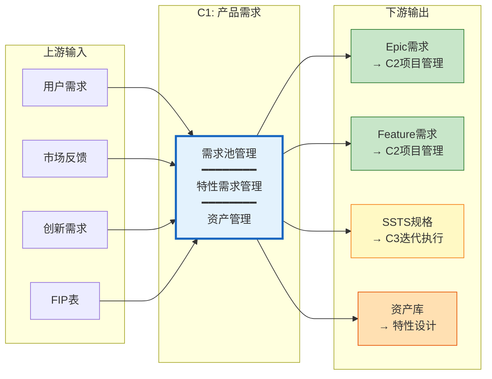

**上游**:
- 接收用户需求、市场反馈、创新需求
- 接收FIP表（整车功能需求表）
- 接收竞品对标分析
- 接收法规合规要求

**下游**:
- 输出Epic需求到C2领域产品项目（用于项目计划和基线管理）
- 输出Feature需求到C2领域产品项目（用于TimePlan规划）
- 输出SSTS规格到C3产品迭代（用于MR创建和Sprint规划）
- 输出资产到特性设计和模块开发（用于复用和参考）

### 1.3 价值流覆盖

| 价值流阶段 | C1能力域作用 | 关键产物 |
|-----------|-------------|---------|
| S1: 车型/产品规划 | 需求池建立、Epic创建 | 需求池、Epic清单 |
| S2: 需求分解 | Feature创建、PRD编写 | Feature列表、PRD文档 |
| S3: 特性设计 | SSTS拆解、设计文档 | SSTS清单、设计文档 |

---

## 二、核心能力设计

### 2.1 核心能力全景（V11.0）

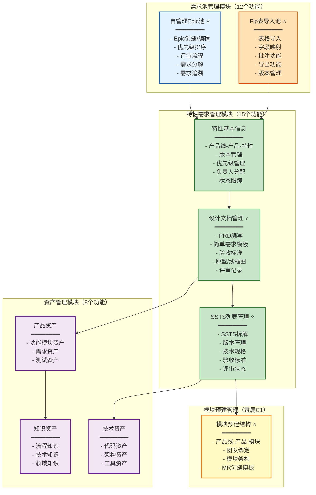

### 2.2 核心能力清单

| 能力模块 | 功能数 | 核心能力 | V11.0创新点 | 优先级 |
|---------|--------|----------|------------|--------|
| **需求池管理** | 12个 | Epic池管理、Fip表导入 | 需求池双模式 ⭐ | P0 |
| **特性需求管理** | 15个 | 特性三级组成、SSTS拆解 | 完整设计闭环 ⭐ | P0 |
| **模块预建管理** | - | 模块结构预建、MR模板 | 模块预建机制 ⭐ | P0 |
| **资产管理** | 8个 | 三层资产管理、复用统计 | 资产合并到C1 | P1 |
| **总计** | **35个** | - | - | - |

---

## 三、需求池管理

### 3.1 需求池双模式架构 ⭐

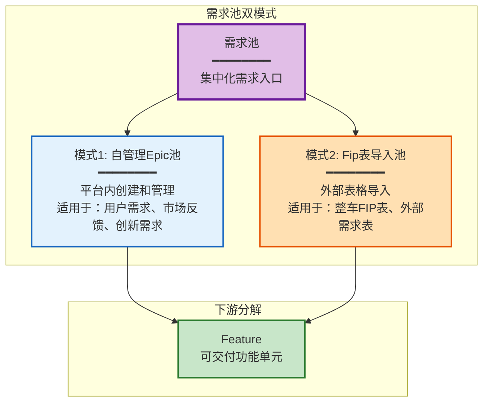

### 3.2 自管理Epic池

#### 3.2.1 核心能力

| 能力 | 说明 | 关键特性 | 优先级 |
|------|------|----------|--------|
| **Epic创建** | 新建Epic需求 | - 多来源（用户反馈、市场需求、创新想法）<br/>- 模板化创建<br/>- 附件上传<br/>- Rich Text编辑器 | P0 |
| **优先级管理** | Epic优先级排序 | - MoSCoW分类（Must/Should/Could/Won't）<br/>- 拖拽排序<br/>- 优先级变更历史<br/>- 批量调整优先级 | P0 |
| **需求评审** | Epic评审流程 | - 评审状态（待评审/评审中/已通过/已拒绝）<br/>- 在线评审<br/>- 评审意见<br/>- 评审历史追溯 | P0 |
| **需求分解** | Epic拆解为Feature | - Epic → Feature映射<br/>- 一对多关系<br/>- 拆解记录<br/>- 双向追溯 | P0 |
| **需求追溯** | 需求来源追溯 | - 来源标记（用户反馈ID、市场需求ID等）<br/>- 需求变更历史<br/>- 影响范围分析 | P1 |

#### 3.2.2 Epic数据结构

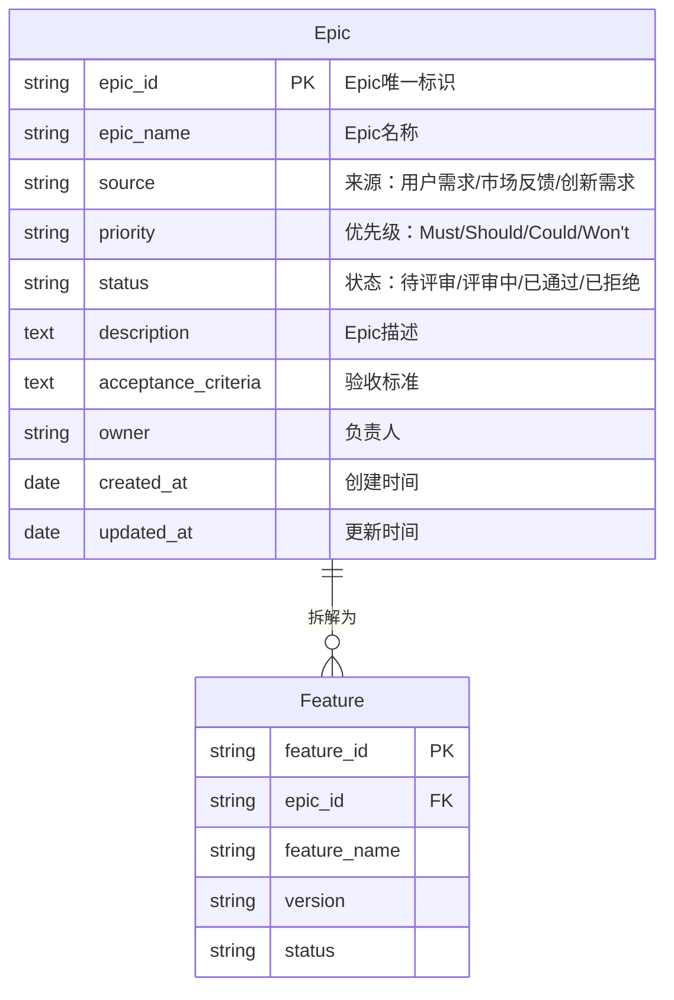

#### 3.2.3 页面设计

**Epic池列表页**:
```
┌────────────────────────────────────────────────────────────┐
│ 需求池 - 自管理Epic池                     [+ 新建Epic] [导出] │
├────────────────────────────────────────────────────────────┤
│ 筛选器: [状态▼] [优先级▼] [来源▼] [负责人▼] [🔍 搜索]        │
├────────────────────────────────────────────────────────────┤
│                                                            │
│ 看板视图 / 列表视图 / 优先级视图                              │
│                                                            │
│ ┌──────────┬──────────┬──────────┬──────────┐           │
│ │ 待评审    │ 评审中    │ 已通过    │ 已拒绝    │           │
│ ├──────────┼──────────┼──────────┼──────────┤           │
│ │ Epic-001 │ Epic-003 │ Epic-005 │ Epic-007 │           │
│ │ ⭐Must    │ ⭐Must    │ ⭐Should  │ Could    │           │
│ │ [拖拽↕]  │          │          │          │           │
│ │          │ Epic-004 │ Epic-006 │          │           │
│ │ Epic-002 │ ⭐Should  │ Could    │          │           │
│ │ ⭐Should  │          │          │          │           │
│ └──────────┴──────────┴──────────┴──────────┘           │
└────────────────────────────────────────────────────────────┘
```

**Epic详情页**:
```
┌────────────────────────────────────────────────────────────┐
│ Epic详情: EPIC-001 - 智能泊车增强功能              [编辑] [删除] │
├────────────────────────────────────────────────────────────┤
│ Tab: [基本信息] [需求描述] [附件] [评审记录] [拆解Feature] [历史] │
├────────────────────────────────────────────────────────────┤
│ 基本信息                                                    │
│ ┌────────────────────────────────────────────────────┐   │
│ │ Epic ID:      EPIC-001                             │   │
│ │ Epic名称:     智能泊车增强功能                        │   │
│ │ 来源:         用户需求                               │   │
│ │ 优先级:       ⭐Must (MoSCoW)                        │   │
│ │ 状态:         已通过                                 │   │
│ │ 负责人:       张三 (PO)                              │   │
│ │ 创建时间:     2026-01-15                            │   │
│ │ 最后更新:     2026-01-28                            │   │
│ └────────────────────────────────────────────────────┘   │
│                                                            │
│ 需求描述                                                    │
│ ┌────────────────────────────────────────────────────┐   │
│ │ [Rich Text Editor]                                  │   │
│ │ 用户希望智能泊车功能支持更多复杂场景...                 │   │
│ └────────────────────────────────────────────────────┘   │
│                                                            │
│ 验收标准                                                    │
│ ┌────────────────────────────────────────────────────┐   │
│ │ - AC1: 支持斜列泊车场景                              │   │
│ │ - AC2: 泊车成功率>95%                               │   │
│ │ - AC3: 泊车时间<60秒                                │   │
│ └────────────────────────────────────────────────────┘   │
└────────────────────────────────────────────────────────────┘
```

### 3.3 Fip表导入池 ⭐

#### 3.3.1 核心能力

| 能力 | 说明 | 关键特性 | 优先级 |
|------|------|----------|--------|
| **Fip表导入** | 导入外部需求表 | - 支持Excel/CSV/JSON格式<br/>- 字段映射配置<br/>- 导入验证<br/>- 导入历史记录 | P0 |
| **表格查看** | 以表格形式查看 | - 分页显示<br/>- 列排序/筛选<br/>- 列显示/隐藏<br/>- 固定列<br/>- 全屏模式 | P0 |
| **批注功能** | 标注修改意见 | - 单元格批注<br/>- 行批注<br/>- 批注颜色标记<br/>- 批注人+时间<br/>- 批注汇总 | P0 |
| **导出功能** | 导出带批注的表 | - 导出为Excel（包含批注）<br/>- 导出为PDF<br/>- 批注单独导出<br/>- 自定义导出范围 | P0 |
| **版本管理** | Fip表版本管理 | - 多版本导入<br/>- 版本对比<br/>- 版本回退<br/>- 版本历史追溯 | P1 |

#### 3.3.2 Fip表导入流程

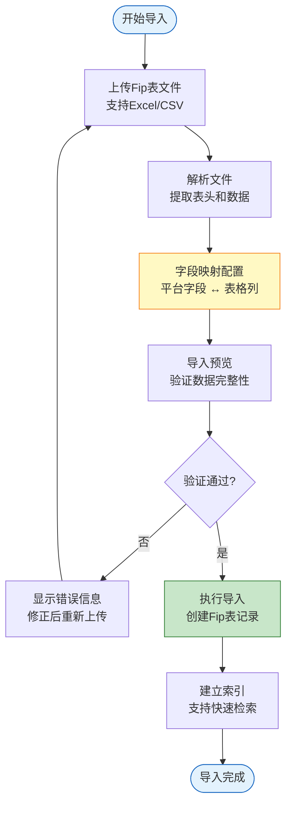

#### 3.3.3 页面设计

**Fip表导入页**:
```
┌────────────────────────────────────────────────────────────┐
│ Fip表导入                                                   │
├────────────────────────────────────────────────────────────┤
│ 步骤1: 上传文件                                              │
│ ┌────────────────────────────────────────────────────┐   │
│ │  [📁 选择文件] 或 拖拽文件到此处                       │   │
│ │  支持格式: .xlsx, .xls, .csv                          │   │
│ │  最大文件大小: 10MB                                   │   │
│ └────────────────────────────────────────────────────┘   │
│                                                            │
│ 步骤2: 字段映射                                              │
│ ┌────────────────────────────────────────────────────┐   │
│ │ 平台字段          ←→   表格列                         │   │
│ │ ─────────────────────────────────────────────────  │   │
│ │ UseCase ID        →   [A: ID列]                     │   │
│ │ UseCase名称       →   [B: 名称列]                    │   │
│ │ 功能描述          →   [C: 描述列]                    │   │
│ │ 优先级            →   [D: 优先级列]                  │   │
│ │ ...                                                  │   │
│ └────────────────────────────────────────────────────┘   │
│                                                            │
│ 步骤3: 导入预览                                              │
│ ┌────────────────────────────────────────────────────┐   │
│ │ 将导入 156 条记录                                     │   │
│ │ ✓ 数据验证通过                                        │   │
│ │ ⚠ 5条记录缺少优先级（将设为默认值）                    │   │
│ └────────────────────────────────────────────────────┘   │
│                                                            │
│                     [取消]  [← 上一步]  [确认导入 →]        │
└────────────────────────────────────────────────────────────┘
```

**Fip表查看页（带批注）**:
```
┌────────────────────────────────────────────────────────────┐
│ Fip表查看: 车型XXX FIP表 V1.2                [导出] [版本管理] │
├────────────────────────────────────────────────────────────┤
│ 工具栏: [筛选▼] [排序▼] [列设置▼] [💬批注模式] [🖨导出]     │
├────────────────────────────────────────────────────────────┤
│ ID  │ UseCase名称        │ 功能描述       │ 优先级 │ 批注 │   │
│─────┼───────────────────┼───────────────┼────────┼──────┤   │
│ 001 │ 智能泊车           │ 支持自动泊车... │ Must   │ 💬2  │   │
│ 002 │ 自适应巡航         │ 跟车距离...    │ Should │ 💬1  │   │
│ 003 │ 车道保持辅助       │ 车道居中...    │ Must   │ -    │   │
│ ... │                    │                │        │      │   │
├────────────────────────────────────────────────────────────┤
│ 批注面板 (右侧滑出)                                          │
│ ┌────────────────────────────────────────────────────┐   │
│ │ UseCase-001: 智能泊车                               │   │
│ │ ├─ 💬 张三 (2026-01-20):                           │   │
│ │ │   建议增加斜列泊车场景                            │   │
│ │ └─ 💬 李四 (2026-01-22):                           │   │
│ │     已确认,纳入需求                                 │   │
│ └────────────────────────────────────────────────────┘   │
└────────────────────────────────────────────────────────────┘
```

---

## 四、特性需求管理

### 4.1 特性三级组成架构 ⭐

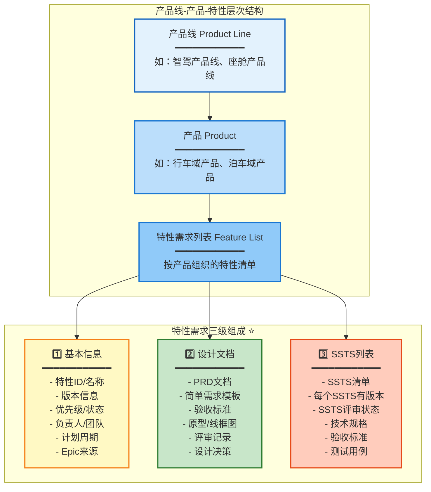

### 4.2 基本信息管理

#### 4.2.1 核心能力

| 能力 | 说明 | 关键特性 | 优先级 |
|------|------|----------|--------|
| **特性创建** | 从Epic创建Feature | - Epic → Feature转化<br/>- 自动继承Epic信息<br/>- 分配到产品<br/>- 版本管理 | P0 |
| **版本管理** | Feature版本管理 | - 版本号规则（如v1.0）<br/>- 版本演进历史<br/>- 版本对比<br/>- 版本回退 | P0 |
| **优先级管理** | 优先级设置和调整 | - P0/P1/P2分级<br/>- 优先级调整历史<br/>- 影响范围分析 | P0 |
| **状态流转** | Feature状态管理 | - 草稿→设计中→评审中→已通过→开发中→已完成<br/>- 状态流转规则<br/>- 状态变更历史 | P0 |
| **负责人分配** | 分配负责人和团队 | - FO（Feature Owner）<br/>- 开发团队<br/>- 负责人变更记录 | P0 |

#### 4.2.2 Feature数据结构

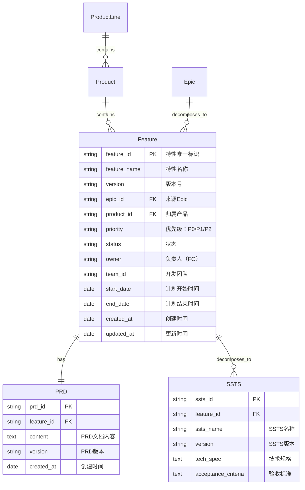

### 4.3 设计文档管理 ⭐

#### 4.3.1 PRD文档编写

**核心能力**:
- **Rich Text编辑器**: 支持富文本编辑（标题、列表、表格、图片、链接等）
- **PRD模板**: 提供标准PRD模板和简化需求模板
- **版本管理**: PRD版本演进和对比
- **在线协作**: 多人协作编辑、评论
- **评审流程**: PRD评审工作流

**PRD标准模板结构**:
```markdown
# PRD: [特性名称]

## 1. 特性概述
- 特性ID: 
- 版本: 
- 负责人: 
- 创建时间: 

## 2. 背景与目标
### 2.1 业务背景
### 2.2 用户需求
### 2.3 目标与价值

## 3. 功能需求
### 3.1 功能概述
### 3.2 用户场景
### 3.3 功能详细描述

## 4. 非功能需求
### 4.1 性能要求
### 4.2 安全要求
### 4.3 合规要求

## 5. 原型设计
### 5.1 线框图
### 5.2 交互说明

## 6. 验收标准
- AC1: ...
- AC2: ...
- AC3: ...

## 7. 约束与假设
### 7.1 技术约束
### 7.2 业务约束
### 7.3 假设条件

## 8. 风险与依赖
### 8.1 风险识别
### 8.2 依赖识别

## 9. 附录
### 9.1 术语表
### 9.2 参考文档
```

#### 4.3.2 页面设计

**PRD编辑页**:
```
┌────────────────────────────────────────────────────────────┐
│ PRD编辑: FEAT-001-智能泊车增强         [模板▼] [版本历史] [预览] │
├────────────────────────────────────────────────────────────┤
│ 工具栏: [B] [I] [U] [H1▼] [列表▼] [表格] [图片] [链接] [保存]  │
├────────────────────────────────────────────────────────────┤
│ [Rich Text Editor - 左侧编辑区]      │ [大纲导航 - 右侧]  │
│                                      │                    │
│ # PRD: 智能泊车增强功能               │ 1. 特性概述        │
│                                      │ 2. 背景与目标      │
│ ## 1. 特性概述                       │   2.1 业务背景     │
│ - 特性ID: FEAT-001                   │   2.2 用户需求     │
│ - 版本: V1.0                         │ 3. 功能需求 ←当前  │
│ - 负责人: 张三                       │   3.1 功能概述     │
│                                      │   3.2 用户场景     │
│ ## 2. 背景与目标                     │ ...                │
│ ### 2.1 业务背景                     │                    │
│ 用户希望智能泊车功能支持更多复杂场景   │ [评论面板]         │
│ ...                                  │ 💬 李四: 这里需要  │
│                                      │    补充性能指标    │
│ ## 3. 功能需求                       │                    │
│ ### 3.1 功能概述                     │                    │
│ ...                                  │                    │
└────────────────────────────────────────────────────────────┘
```

### 4.4 SSTS列表管理 ⭐

#### 4.4.1 SSTS拆解规则

**拆解原则**:
- **场景化**: 每个SSTS对应一个完整的功能场景
- **可测试**: 有明确的验收标准和测试用例
- **可开发**: 粒度适中，可分配给模块开发
- **可追溯**: 与Feature和PRD保持追溯关系

**拆解流程**:
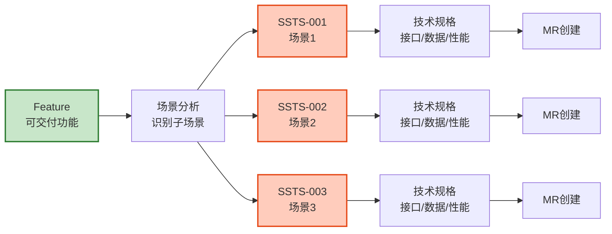

#### 4.4.2 SSTS数据结构

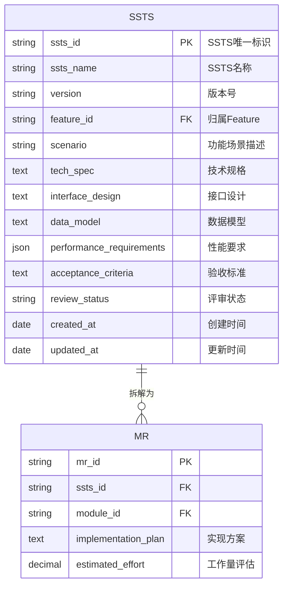

#### 4.4.3 页面设计

**SSTS列表页**:
```
┌────────────────────────────────────────────────────────────┐
│ Feature: FEAT-001 智能泊车增强 > SSTS列表    [+ 新建SSTS]    │
├────────────────────────────────────────────────────────────┤
│ ID      │ SSTS名称          │ 版本  │ 状态    │ 评审  │ 操作 │
│─────────┼──────────────────┼───────┼─────────┼───────┼──────┤
│ SSTS-01 │ 斜列泊车场景      │ V1.0  │ 已通过  │ ✓     │ 详情 │
│ SSTS-02 │ 垂直泊车场景      │ V1.0  │ 评审中  │ ⏳    │ 详情 │
│ SSTS-03 │ 狭窄车位泊车      │ V1.0  │ 草稿    │ -     │ 详情 │
│ SSTS-04 │ 泊车异常处理      │ V1.0  │ 草稿    │ -     │ 详情 │
├────────────────────────────────────────────────────────────┤
│ 统计: 总计4个SSTS | 已通过1个 | 评审中1个 | 草稿2个          │
└────────────────────────────────────────────────────────────┘
```

**SSTS详情页**:
```
┌────────────────────────────────────────────────────────────┐
│ SSTS详情: SSTS-001 - 斜列泊车场景              [编辑] [评审]  │
├────────────────────────────────────────────────────────────┤
│ Tab: [基本信息] [技术规格] [接口设计] [验收标准] [拆解MR]   │
├────────────────────────────────────────────────────────────┤
│ 基本信息                                                    │
│ ┌────────────────────────────────────────────────────┐   │
│ │ SSTS ID:       SSTS-001                            │   │
│ │ SSTS名称:      斜列泊车场景                         │   │
│ │ 版本:          V1.0                                │   │
│ │ 归属Feature:   FEAT-001 智能泊车增强                │   │
│ │ 评审状态:      已通过 ✓                            │   │
│ │ 负责人:        李四 (SE)                            │   │
│ └────────────────────────────────────────────────────┘   │
│                                                            │
│ 功能场景描述                                                │
│ ┌────────────────────────────────────────────────────┐   │
│ │ 用户在斜列式停车场中，车辆能够自动识别斜列车位，      │   │
│ │ 并完成自动泊车操作...                                │   │
│ └────────────────────────────────────────────────────┘   │
│                                                            │
│ 技术规格                                                    │
│ ┌────────────────────────────────────────────────────┐   │
│ │ 性能要求:                                           │   │
│ │ - 车位识别准确率 ≥ 98%                              │   │
│ │ - 泊车成功率 ≥ 95%                                  │   │
│ │ - 泊车时间 ≤ 60秒                                   │   │
│ │                                                     │   │
│ │ 数据模型:                                           │   │
│ │ - 车位数据结构                                       │   │
│ │ - 泊车路径规划                                       │   │
│ └────────────────────────────────────────────────────┘   │
└────────────────────────────────────────────────────────────┘
```

---

## 五、资产管理

### 5.1 三层资产架构

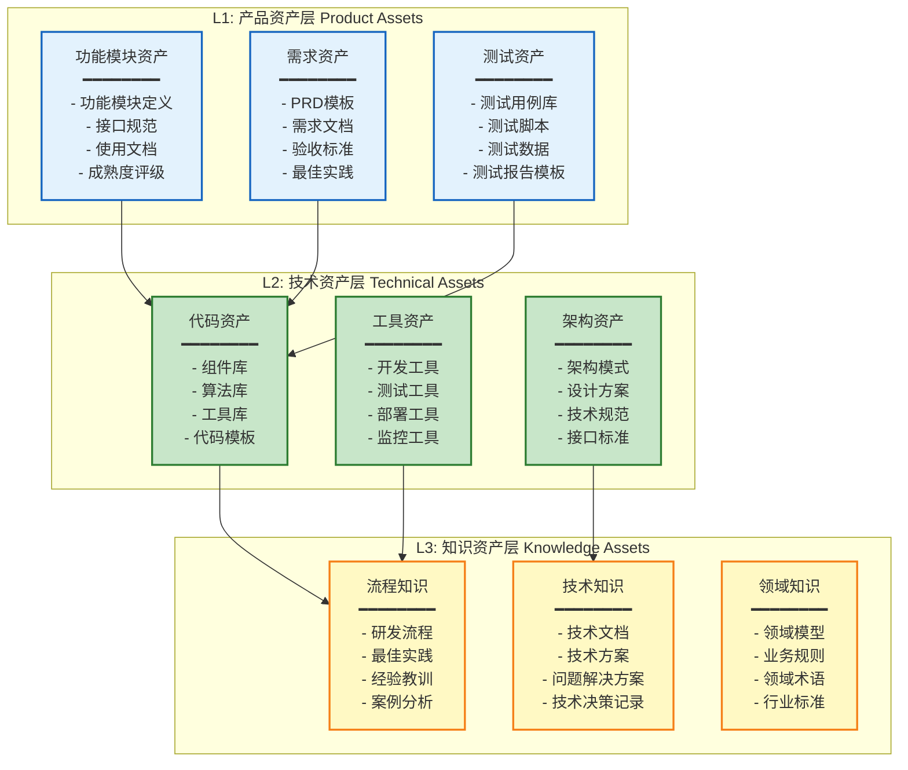

### 5.2 产品资产管理

**核心能力**:
- 功能模块资产库
- 成熟度评级（L1-L5）
- 复用次数统计
- 资产检索和推荐

**详细设计**: 参见 `domain-models/5.2-三层资产模型.md`

---

## 六、核心流程设计

### 6.1 需求全流程

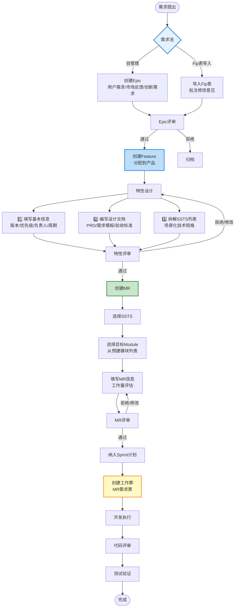

---

## 七、数据模型设计

### 7.1 核心实体ER图

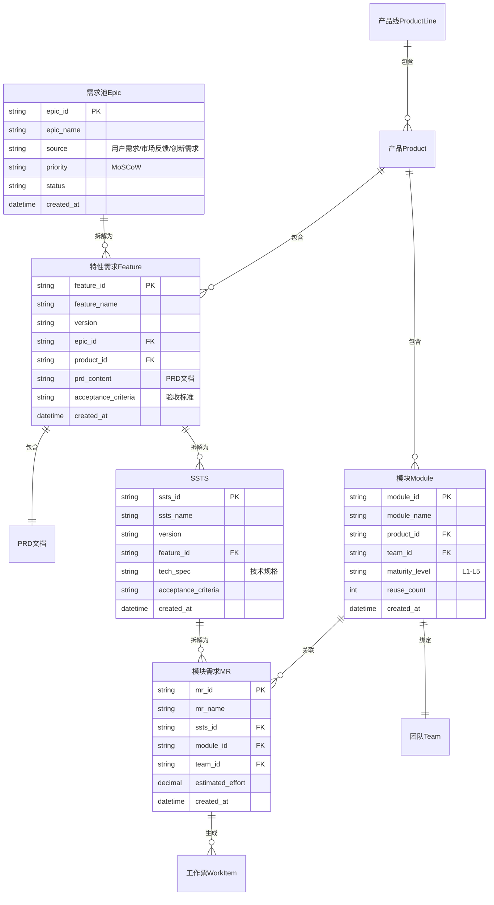

---

## 八、页面架构设计

### 8.1 C1能力域导航结构

```
C1: 产品需求
├── 需求池管理
│   ├── 自管理Epic池
│   │   ├── Epic列表（看板视图/列表视图/优先级视图）
│   │   ├── Epic详情
│   │   └── Epic创建/编辑
│   └── Fip表导入池
│       ├── 导入功能
│       ├── Fip表列表
│       ├── Fip表查看（带批注）
│       └── 版本管理
├── 产品线管理
│   ├── 产品线列表
│   ├── 产品列表（按产品线分组）
│   └── 产品创建/编辑
├── 特性需求管理
│   ├── 特性列表（树形视图/列表视图/看板视图/甘特图视图）
│   ├── 特性详情
│   │   ├── Tab1: 基本信息
│   │   ├── Tab2: 设计文档（PRD编辑器）
│   │   ├── Tab3: SSTS列表
│   │   ├── Tab4: 评审记录
│   │   ├── Tab5: 追溯关系
│   │   └── Tab6: 变更历史
│   └── 特性创建/编辑
├── SSTS管理
│   ├── SSTS列表（跨特性汇总）
│   ├── SSTS详情
│   └── SSTS创建/编辑
├── 模块管理
│   ├── 模块列表（按产品组织）
│   ├── 模块详情
│   └── 模块创建/编辑
└── 资产管理
    ├── 产品资产库
    ├── 技术资产库
    ├── 知识资产库
    └── 资产检索
```

---

## 九、功能清单

### 9.1 需求池管理功能（12个）

| 编号 | 功能名称 | 功能描述 | 优先级 | 工作量(SP) |
|------|---------|---------|--------|-----------|
| F01 | Epic创建 | 在需求池中创建Epic，填写基本信息 | P0 | 5 |
| F02 | Epic编辑 | 编辑Epic信息，附件管理 | P0 | 3 |
| F03 | Epic优先级排序 | MoSCoW分类，拖拽排序 | P0 | 5 |
| F04 | Epic评审 | 发起评审，评审意见，评审通过/拒绝 | P0 | 8 |
| F05 | Epic分解 | Epic拆解为Feature，建立追溯关系 | P0 | 5 |
| F06 | Fip表导入 | 导入Excel/CSV，字段映射 | P0 | 8 |
| F07 | Fip表查看 | 表格查看，分页、排序、筛选 | P0 | 5 |
| F08 | 批注功能 | 单元格批注，行批注，批注管理 | P0 | 8 |
| F09 | Fip表导出 | 导出带批注的Excel/PDF | P0 | 5 |
| F10 | 版本管理 | Fip表多版本管理，版本对比 | P1 | 5 |
| F11 | 需求追溯 | Epic追溯到来源，变更历史 | P1 | 3 |
| F12 | 需求统计 | Epic数量、优先级分布统计 | P1 | 3 |

### 9.2 特性需求管理功能（15个）

| 编号 | 功能名称 | 功能描述 | 优先级 | 工作量(SP) |
|------|---------|---------|--------|-----------|
| F13 | Feature创建 | 从Epic创建Feature，分配到产品 | P0 | 5 |
| F14 | 基本信息管理 | 版本、优先级、负责人、计划周期 | P0 | 5 |
| F15 | PRD编辑 | Rich Text编辑器，PRD模板 | P0 | 13 |
| F16 | PRD评审 | 发起评审，在线评论，评审流程 | P0 | 8 |
| F17 | SSTS拆解 | 场景化拆解，创建SSTS列表 | P0 | 8 |
| F18 | SSTS技术规格 | 接口设计、数据模型、性能要求 | P0 | 8 |
| F19 | SSTS评审 | 技术评审流程 | P0 | 5 |
| F20 | 验收标准定义 | Given-When-Then验收标准 | P0 | 5 |
| F21 | 原型/线框图 | 上传原型图，在线查看 | P1 | 5 |
| F22 | Feature版本管理 | 版本演进，版本对比 | P1 | 5 |
| F23 | Feature状态流转 | 状态管理，状态变更历史 | P0 | 5 |
| F24 | Feature追溯 | 追溯到Epic，追溯到SSTS/MR | P1 | 3 |
| F25 | 特性列表视图 | 树形视图、列表视图、看板视图、甘特图视图 | P0 | 13 |
| F26 | 特性统计 | Feature数量、状态分布统计 | P1 | 3 |
| F27 | 批量操作 | 批量分配、批量状态变更 | P1 | 5 |

### 9.3 资产管理功能（8个）

| 编号 | 功能名称 | 功能描述 | 优先级 | 工作量(SP) |
|------|---------|---------|--------|-----------|
| F28 | 资产创建 | 创建产品/技术/知识资产 | P1 | 5 |
| F29 | 资产分类 | 三层资产分类管理 | P1 | 3 |
| F30 | 成熟度评级 | L1-L5成熟度评级 | P1 | 5 |
| F31 | 资产检索 | 关键字检索，标签筛选 | P1 | 8 |
| F32 | 资产复用统计 | 复用次数，复用率统计 | P1 | 5 |
| F33 | 资产推荐 | 基于场景的资产推荐 | P2 | 8 |
| F34 | 资产版本管理 | 资产版本演进 | P1 | 5 |
| F35 | 资产评价 | 用户评价，评分 | P2 | 5 |

**总计**: 35个功能，P0功能26个，P1功能7个，P2功能2个

---

## 十、集成设计

### 10.1 上游集成（输入）

| 集成点 | 集成内容 | 集成方式 | 说明 |
|--------|---------|---------|------|
| 用户反馈系统 | 用户需求、问题反馈 | API/Webhook | 自动同步到Epic池 |
| 市场分析系统 | 市场需求、竞品分析 | API | 手动导入或API同步 |
| 整车FIP系统 | FIP表（Excel） | 文件导入 | 支持批注和版本管理 |
| 法规合规系统 | 法规要求 | API/手动录入 | 作为Epic或Feature |

### 10.2 下游集成（输出）

| 集成点 | 集成内容 | 集成方式 | 说明 |
|--------|---------|---------|------|
| C2领域产品项目 | Epic、Feature列表 | 内部API | 用于TimePlan规划 |
| C3产品迭代 | SSTS、MR | 内部API | 用于Sprint规划 |
| 资产库 | 产品/技术/知识资产 | 内部API | 供其他模块复用 |
| 外部系统 | Epic/Feature导出 | Excel/API | 支持数据导出 |

### 10.3 核心API接口

**Epic管理API**:
- `POST /api/v1/epics` - 创建Epic
- `GET /api/v1/epics` - 获取Epic列表
- `GET /api/v1/epics/{id}` - 获取Epic详情
- `PUT /api/v1/epics/{id}` - 更新Epic
- `DELETE /api/v1/epics/{id}` - 删除Epic

**Feature管理API**:
- `POST /api/v1/features` - 创建Feature
- `GET /api/v1/features` - 获取Feature列表
- `GET /api/v1/features/{id}` - 获取Feature详情
- `PUT /api/v1/features/{id}` - 更新Feature
- `PUT /api/v1/features/{id}/prd` - 更新PRD文档

**SSTS管理API**:
- `POST /api/v1/ssts` - 创建SSTS
- `GET /api/v1/ssts` - 获取SSTS列表
- `GET /api/v1/ssts/{id}` - 获取SSTS详情
- `PUT /api/v1/ssts/{id}` - 更新SSTS

---

## 十一、技术架构

### 11.1 技术栈

**前端**:
- React 19+ + TypeScript
- Ant Design 6+ (UI组件库)
- Rich Text Editor: Slate.js / TipTap
- 表格组件: ag-Grid (支持大数据量、批注)
- 状态管理: Zustand
- 可视化: @antv/g6 (树形图、关系图)

**后端**:
- Node.js + Express / Java Spring Boot
- PostgreSQL (关系型数据)
- MongoDB (PRD文档存储)
- Redis (缓存、会话)
- Elasticsearch (全文搜索)
- MinIO / OSS (附件存储)

**集成**:
- RESTful API
- Webhook (事件通知)
- Message Queue (异步任务)

### 11.2 架构分层

```
┌─────────────────────────────────────────┐
│         前端展现层 Presentation          │
│  (React + Ant Design + Rich Text)       │
└─────────────────────────────────────────┘
                  ↓ RESTful API
┌─────────────────────────────────────────┐
│         业务服务层 Business Service      │
│  (需求池、特性管理、资产管理服务)         │
└─────────────────────────────────────────┘
                  ↓
┌─────────────────────────────────────────┐
│     领域能力层 Domain Capabilities       │
│  (可视化、追溯、迁移、模版能力)           │
└─────────────────────────────────────────┘
                  ↓
┌─────────────────────────────────────────┐
│       数据访问层 Data Access Layer       │
│  (ORM、缓存、搜索)                       │
└─────────────────────────────────────────┘
                  ↓
┌─────────────────────────────────────────┐
│         数据存储层 Data Storage          │
│  (PostgreSQL、MongoDB、Redis、ES)        │
└─────────────────────────────────────────┘
```

---

## 十二、总结

### 12.1 C1能力域核心价值

1. **需求池驱动** ⭐: 双模式需求池（自管理+Fip导入），集中化需求管理入口
2. **特性完整闭环** ⭐: 三级组成（基本信息+设计文档+SSTS列表），完整设计流程
3. **模块预建机制** ⭐: 产品-模块预建结构，MR创建时关联明确
4. **资产沉淀复用**: 三层资产（产品+技术+知识），促进复用和知识沉淀

### 12.2 V11.0核心创新

- **需求池双模式**: 支持平台自管理 + 外部Fip表导入，灵活适配不同需求来源
- **特性三级组成**: 从基本信息到设计文档再到SSTS拆解，形成完整设计闭环
- **模块预建机制**: 模块提前建立并绑定团队，MR创建时直接关联
- **端到端追溯**: Epic → Feature → SSTS → MR → 工作票完整追溯链路

### 12.3 实施建议

**阶段1: MVP (4-6周)**
- 自管理Epic池（基础功能）
- Feature基本信息管理
- PRD简单编辑
- SSTS拆解

**阶段2: V1.0 (8-10周)**
- Fip表导入和批注
- PRD Rich Text编辑器
- SSTS技术规格完善
- 评审流程

**阶段3: V2.0 (6-8周)**
- 资产管理
- 高级检索和推荐
- 数据统计和分析
- 集成第三方系统

---

**参考文档**:
- `AUTO_RD_PLATFORM_DESIGN_MERMAID.md` - 主文档第6.2章节
- `平台方案设计-V11.0-需求三层模型重构版.md` - V11.0完整设计
- `domain-models/5.1-三层需求模型.md` - 需求模型详细设计
- `domain-models/5.2-三层资产模型.md` - 资产模型详细设计

**维护者**: Design Studio Team  
**最后更新**: 2026-01-28
