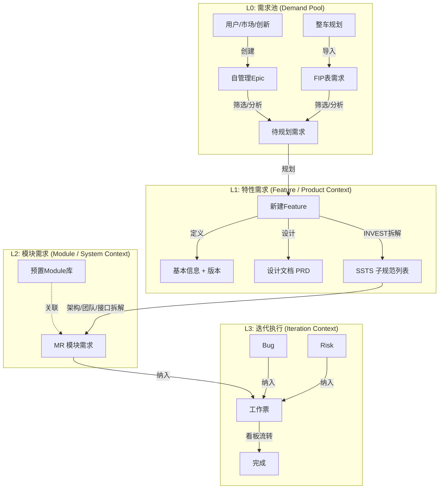

# PRD：需求管理体系重构方案 (Requirement Management Redesign)

## 1. 概述与目标

### 1.1 背景
为了更好地支撑整车软件研发的端到端协同，需对现有的需求管理体系进行重构。新方案聚焦于**需求的拆分流程**、**从需求到迭代的流转**以及**可视化的看板协作**，核心引入**"需求池-特性需求-模块需求"**的三层需求模型，并明确各层级的拆分维度和管理方式。

### 1.2 核心目标
1.  **统一入口**：通过"需求池"集中管理所有原始需求（FIP导入 + 自建Epic）。
2.  **闭环设计**：特性需求（Feature）必须包含设计文档（PRD）和SSTS拆解，实现"设计即需求"。
3.  **结构化落地**：模块需求（MR）必须关联预定义的架构模块，确保开发任务职责清晰。
4.  **迭代驱动**：所有执行项（MR、Bug、Task）统一为"工作票"，在迭代中进行看板协作。

---

## 2. 核心业务模型：三层需求体系

### L0 需求池 (Requirement Pool)
需求池是所有需求的源头，负责收集、初步筛选和优先级排序。

*   **定位**：原始需求管理，Feature的上游。
*   **入口位置**：主页 C1产品需求模块 -> 三级导航顶部（位于"全部产品线"上方）。
*   **组成部分**：
    1.  **自管理需求 (Self-managed Epics)**：
        *   **来源**：用户需求、市场反馈、内部创新、技术演进等。
        *   **操作**：支持新建、编辑、删除、状态流转。
        *   **属性**：Epic名称、描述、优先级 (P0-P2)、来源、负责PO。
    2.  **FIP导入需求 (FIP Imports)**：
        *   **来源**：整车FIP表（Excel/CSV）。
        *   **操作**：仅支持**导入**和**查看**。**不可直接修改**原始内容。
        *   **批注**：支持在FIP条目上添加"修改意见"或"备注"。
        *   **导出**：支持将带有修改意见的FIP表导出。

### L1 特性需求 (Feature Requirements)
特性需求是产品维度的核心交付单元，承接L0需求并进行具体设计。

*   **定位**：产品功能的具体定义与设计。
*   **入口位置**：进入具体"产品线/产品" -> 二级导航顶部（替换原有的占位Tab）。
*   **三级基本组成**：每一特性需求必须包含以下三部分：
    1.  **基本信息 (Info)**：
        *   Feature标题、描述、优先级、状态、**目标版本**。
        *   关联的L0 Epic/FIP条目。
    2.  **设计文档 (Design)**：
        *   在线文档编辑器（支持Markdown/富文本）。
        *   内容模板：PRD、简易需求模板等。
        *   版本管理：设计文档需支持版本控制。
    3.  **SSTS 列表 (Splitting)**：
        *   从Feature拆解出的系统子技术规范（System Technical Specification）。
        *   每个SSTS需指定**实现版本**（可能与Feature版本不同，分批交付）。

*   **Feature → SSTS 拆分维度**：
    *   **按子功能** (Sub-functions)：如"登录"拆分为"账号登录"、"扫码登录"。
    *   **按流程** (Flows)：如"订单处理"拆分为"创建"、"支付"、"发货"。
    *   **按场景** (Scenarios)：如"自动泊车"拆分为"垂直泊位"、"侧方泊位"。
    *   **非功能** (Non-functional)：安全性、性能、兼容性要求。

### L2 模块需求 (Module Requirements - MR)
模块需求是面向开发团队的执行单元，由SSTS进一步拆解而来，并与系统架构绑定。

*   **定位**：可被分配给具体模块/团队开发的工作项。
*   **预置前提**：**Module（模块）必须提前建立**。
    *   管理路径：产品线 -> 产品 -> 模块管理。
    *   MR创建时，必须选择所属的Module，不能由MR临时创建Module。
*   **关系**：一个SSTS可以拆解为多个MR（1:N）。

*   **SSTS → MR 拆分维度**：
    *   **按架构Module**：前端、后端、嵌入式Control、嵌入式Perception等。
    *   **按团队**：A组负责UI，B组负责算法。
    *   **按接口**：API定义、数据协议。
    *   **按应用场景**：具体的Case实现。

---

## 3. 迭代执行体系：工作票 (Work Items)

当MR进入迭代（Sprint）后，转化为**工作票**进行管理。工作票是迭代看板上的最小流转单元。

### 3.1 工作票类型
1.  **MR需求票**：承接自L2模块需求，价值交付的核心。
2.  **Bugfix票**：缺陷修复。
3.  **风险票 (Risk)**：识别到的项目风险，需跟踪处理。
4.  **依赖票 (Dependency)**：外部依赖项，需协调解决。
5.  **技术任务 (Tech Task)**：重构、调研、环境搭建等非功能性任务。

### 3.2 核心原则：INVEST
所有进入迭代的工作票（特别是MR）必须遵循INVEST原则：
*   **I**ndependent (独立)
*   **N**egotiable (可协商)
*   **V**aluable (有价值)
*   **E**stimatable (可估算)
*   **S**mall (小粒度)
*   **T**estable (可测试)

---

## 4. 详细页面与导航设计 (Navigation & UI)

### 4.1 全局导航结构 (主页)

*   **L1 模块导航**: C1 产品需求
*   **L3 侧边导航 (C1内部)**:
    *   **需求池 (Requirement Pool)**  <-- [NEW, 位于顶部]
        *   自管理需求 (Self-managed)
        *   FIP导入 (FIP Imports)
    *   **全部产品线 (All Product Lines)**
    *   **我的产品线 (My Product Lines)**
    *   ...

### 4.2 需求池页面 (Requirement Pool Page)

#### Tab 1: 自管理需求
*   **列表字段**: ID, 标题, 优先级,状态, 创建人, 来源.
*   **操作**: "新建Epic", "编辑", "删除", "转Feature".

#### Tab 2: FIP导入
*   **工具栏**: "导入FIP", "导出(含批注)".
*   **列表视图**: 只读表格展示FIP原始数据。
*   **操作**: 点击行内 "添加备注/修改意见".

### 4.3 产品/特性详情页 (Feature Management Context)

**入口**: 点击 L3导航中的某个产品 (如 "智能座舱 OS") -> 进入详情页。

**L2 顶部导航 (Tabs)**:
1.  **概览 (Overview)**
2.  **特性规划 (Features)** <-- [核心改造区域]
3.  **模块管理 (Modules)** <-- [MR的依赖基础]
4.  **版本管理 (Releases)**

#### "特性规划" Tab 内容
*   **左侧**: 特性树/列表 (Feature List)。支持按版本、状态筛选。
*   **右侧**: 特性详情区 (Feature Detail)。包含三个子Tab:
    1.  **基本信息 (Base Info)**: 表单展示。
    2.  **设计文档 (Design Doc)**: 嵌入式文档编辑器。
    3.  **SSTS拆解 (SSTS List)**: 交互式列表。
        *   操作: "新增SSTS", "拆分MR".
        *   列显示: SSTS标题, 版本, 状态, 关联MR数量.

### 4.4 迭代工作台 (Team Workbench / C3)

*   **看板视图**: 列可配置 (To Do, In Progress, Testing, Done).
*   **泳道**: 按工作票类型 (MR, Bug, Tech) 或 按人员划分。
*   **卡片内容**: ID, 标题, 负责人, 剩余工时, 关联SSTS/Feature.

---

## 5. 业务流程图 (Logic Flow)

